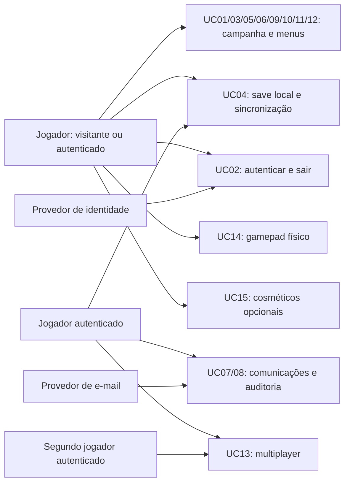

# Casos de uso

## Atores e fronteira

- **Jogador:** pessoa que joga, autenticada ou visitante.
- **Jogador autenticado:** especialização com acesso a serviços privados da conta.
- **Segundo jogador autenticado:** outro participante da corrida multiplayer; ambos precisam de login.
- **Provedor de identidade:** serviço externo de autenticação (Google previsto).
- **Provedor de e-mail:** serviço externo de envio.

Frontend, backend, banco e auditoria são partes do sistema, não atores externos. Gamepad é dispositivo de entrada, não pessoa/conta. O perfil administrativo não faz parte do escopo aprovado; acesso operacional aos logs está em D06.

## UC01 — Abrir o jogo

**Ator:** Jogador. **Pré-condição:** navegador desktop e acesso ao site.

1. Baixar frontend/assets sob demanda, inicializar Phaser e exibir Menu Principal.
2. Verificar save local e dispositivos de entrada disponíveis.
3. Oferecer Novo Jogo, Continue quando houver save, login e acesso ao modo multiplayer planejado.

**Alternativa:** falha no carregamento informa erro e permite tentar novamente.

**Pós-condição:** menu utilizável por teclado e, no suporte planejado, gamepad.

## UC02 — Entrar/sair da conta

**Atores:** Jogador e provedor de identidade. **Pré-condição:** frontend disponível.

1. Solicitar entrada com Google via Cognito; serviço Conta integra o fluxo gerenciado e valida a identidade antes de criar/associar o perfil.
2. Criar/identificar conta, estabelecer sessão e registrar login.
3. Se for primeiro cadastro, solicitar comunicações de boas-vindas (UC07), sem bloquear a sessão por falha de envio.
4. Consultar campanha da conta e tratar cópia local conforme UC04/D05.
5. Ao sair, invalidar a sessão e registrar logout.

**Alternativas:** cancelamento/erro retorna ao menu; sessão expirada solicita novo login para recursos privados.

**Pós-condição:** conta identificada ou sessão encerrada; dados de outra conta não ficam acessíveis na sessão seguinte.

## UC03 — Jogar fase, coletar créditos e ativar checkpoint

**Ator:** Jogador. **Pré-condição:** fase liberada e entrada disponível.

1. Alex corre automaticamente; jogador usa teclado/gamepad para ações permitidas pelos implantes e estado atual.
2. Processar obstáculos, ataque, scan, dash e coleta conforme RN02/RN03.
3. Em checkpoint: parada diegética, consolidação de créditos, persistência e retomada automática.
4. No fim da fase: consolidar o restante e seguir para clínica, Portão ou resolução da descida conforme o contexto.

**Alternativas:** morte descarta créditos não consolidados e retorna ao início/checkpoint; quebrável oferece janela de reação antes de matar; saída retoma posteriormente conforme RN01.

**Pós-condição:** estado consistente, sem duplicar crédito consolidado.

## UC04 — Salvar, continuar e sincronizar campanha

**Ator:** Jogador; autenticação exigida apenas para cópia na nuvem.

1. Atualizar save local nos marcos persistentes: checkpoint, fim de fase, implantação, escolha narrativa, retry, retirada, final e retorno ao Portão.
2. Ao continuar, restaurar início/checkpoint, créditos consolidados, implantes e estado narrativo; descartar créditos transitórios.
3. Se autenticado, enviar campanha e revisão esperada para API.
4. Microsserviço Campanha valida proprietário, estrutura e transições; grava revisão e evento durável na mesma transação. Serviço Auditoria recebe o evento por fila; cliente confirma sincronização após a transação.

**Alternativas:** visitante conserva save local; API indisponível mantém cópia local e informa sincronização pendente; revisão divergente impede sobrescrita automática e aciona resolução D05. Memória recém-recuperada permanece pendente até a retirada; morte, reinício manual ou saída anterior ao procedimento a remove (D10 aprovada). Ao carregar após saída, eliminar coleta pendente da sessão anterior; preservar memórias consolidadas.

**Reconciliação aprovada (D05):** no login, carregar a campanha remota e identificar o cache da mesma conta e a cópia visitante, sem misturá-los. Quando houver conflito, apresentar as cópias e exigir escolha; importação visitante exige confirmação mesmo sem save remoto. Escolher local envia a revisão remota atual como condição; novo conflito exige nova escolha, não sobrescrita forçada. Escolher remoto exige confirmação antes de descartar divergências locais. Cancelar mantém ambas. Se as cópias coincidem, continuar normalmente.

Manter visitante separado após importação; logout não transforma save da conta em visitante. Na troca de conta, isolar credenciais, cache e envios pendentes pela identidade original. Desbloqueios cosméticos vêm da conta e não da cópia da campanha escolhida.

**Pós-condição:** um save ativo por contexto local/conta; não há criação de slots adicionais.

## UC05 — Receber implante na clínica

**Ator:** Jogador. **Pré-condição:** concluir Fase 1–4.

1. Exibir cena com George, conforme evolução narrativa.
2. Executar procedimento previsto para a fase, sem escolha de aceitar/recusar; alterar corpo e habilidade.
3. Persistir transição (UC04) e seguir para próxima fase.

**Alternativa:** falha no save remoto mantém progresso local e aviso; não inventar final por recusa ao implante.

**Pós-condição:** implante correto adquirido uma única vez, na ordem RN04.

## UC06 — Escolher no Portão

**Ator:** Jogador. **Pré-condição:** concluir Topo na ascensão.

1. Criar snapshot pré-Portão antes de apresentar a escolha.
2. Aceitar conversão inicia Chrome; recusar recarrega Topo como descida com primeira memória.
3. Persistir escolha/transição e auditar quando processada no backend.

**Alternativa:** sair antes de escolher conserva snapshot pré-Portão.

**Pós-condição:** ramo selecionado, snapshot preservado para UC12.

## UC07 — Receber e-mail e notificação

**Atores:** Jogador autenticado e provedor de e-mail. **Pré-condição:** evento elegível; canais aprovados em D07.

1. Primeiro cadastro cria solicitação de e-mail e notificação de boas-vindas.
2. Microsserviço Comunicações recebe o evento por SQS, disponibiliza notificação na conta e envia e-mail pelo SES. O sandbox do SES limita destinatários antes da aprovação de produção (documento 12).
3. Jogador consulta notificações e pode marcar uma delas como lida.
4. Central mostra avisos por categoria, permite marcar leitura e alterar preferências; consultar no menu, sem polling permanente.
5. D07 aprovada inclui marcos consolidados, resultados e compras opcionais; compra gera aviso apenas no jogo, sem e-mail. Final pode gerar e-mail por preferência. SES/SNS/SQS informa entrega, bounce e reclamação ao serviço. Ver [documento 14](14-salas-e-notificacoes.md).

**Alternativa:** falha de envio é registrada e permite retentativa sem bloquear gameplay nem duplicar mensagem por novo login.

**Pós-condição:** estado de entrega/leitura registrado por canal.

## UC08 — Consultar auditoria própria

**Ator:** Jogador autenticado. **Pré-condição:** sessão válida.

1. Solicitar lista paginada de eventos próprios.
2. Backend filtra pelo proprietário e devolve eventos sem segredos.

**Alternativa:** acesso a recurso alheio é negado; privilégios administrativos dependem de D06.

**Pós-condição:** operações críticas disponíveis para análise autorizada.

## UC09 — Pausar, reiniciar fase ou iniciar Novo Jogo

**Ator:** Jogador. **Pré-condição:** campanha carregada; para Novo Jogo basta menu disponível.

1. Pausar congela simulação/cooldowns; retomar restaura execução.
2. Reiniciar Fase retorna ao início da fase atual, conservando IDs/créditos consolidados e descartando transitórios.
3. Novo Jogo solicita confirmação se houver save; confirmação substitui campanha e zera carteira, preservando cosméticos opcionais.

**Alternativas:** cancelar confirmação preserva campanha; multiplayer não pausa; retry especial não é consumido por reinício manual durante a tentativa.

**Pós-condição:** aplicar somente a operação escolhida; sem replay livre de fases concluídas.

## UC10 — Recuperar memórias e resolver a cadeia

**Ator:** Jogador. **Pré-condição:** recusar Portão e cadeia ativa.

1. Percorrer setor da descida, localizar rota secreta e recuperar a memória como pendente.
2. Encaminhar para retirada correspondente (UC11) e próximo setor.
3. Ao concluir setor sem memória pela primeira vez, oferecer repetição especial.
4. Se aceita, reiniciar setor com cadeia ativa e registrar retry usado.

**Alternativas:** recusar retry ou falhar novamente quebra cadeia, desativa próximos glitches e retiradas e encaminha ao Hollow; reinício manual e morte não consomem retry por si sós. Morte, reinício manual ou saída antes da retirada apaga a memória pendente e exige recoleta; memórias de procedimentos concluídos permanecem, conforme D10 aprovada. Checkpoint não consolida memória. D12 aprovada: memória sempre após o último checkpoint e antes da retirada; o percurso permite recoleta a partir do ponto de retorno.

**Pós-condição:** próxima etapa válida, ou corpo preservado para Hollow.

## UC11 — Retirar implante e realizar bioprinting

**Ator:** Jogador. **Pré-condição:** memória correspondente recuperada, retirada ainda não realizada.

1. Na primeira etapa, exibir recusa de George e encaminhar à ReForge.
2. Apresentar unidade/holograma, recolher implante e reconstruir tecido orgânico.
3. Remover habilidade, atualizar corpo e consolidar a memória correspondente na mesma transição persistida, uma única vez. Limpar a memória pendente; mortes posteriores preservam essa memória.
4. Após quarta retirada, encaminhar ao epílogo Flesh.

**Alternativa:** cadeia quebrada não permite novas retiradas.

**Pós-condição:** implantes e aparência correspondem à ordem D1–D4; o pai da unidade Industrial é apenas holograma.

## UC12 — Concluir campanha e repetir escolha do Portão

**Ator:** Jogador. **Pré-condição:** Chrome, quatro retiradas ou cadeia quebrada.

1. Mostrar final correspondente: Chrome com pai; Flesh com retorno humano; Hollow com transições e implantes restantes.
2. Registrar final e exibir opções pós-créditos.
3. Continuar do Portão restaura integralmente snapshot anterior à escolha; Novo Jogo segue UC09.

**Alternativa:** sair e retornar preserva estado persistido; não reconstruir snapshot a partir de um corpo já modificado pela descida.

**Pós-condição:** campanha concluída ou restaurada antes da bifurcação.

## UC13 — Disputar corrida multiplayer

**Atores:** Jogador autenticado e segundo jogador autenticado. **Pré-condição:** modo disponível e sessão válida para ambos.

Visitante que seleciona o modo deve primeiro concluir UC02; cancelamento/erro de login não permite entrar na sala.

1. Criar ou entrar em sala mantida pelo backend; aguardar dois jogadores prontos e carregar pista própria com kit completo, checkpoint central e créditos individuais. D03 aprovada: criar convite privado por código/link ou confirmar entrada com convite recebido; validar prazo e reservar segunda vaga atomicamente. Ver [documento 14](14-salas-e-notificacoes.md).
2. Confirmar canal autenticado e margem de vida útil da conexão antes da largada; iniciar corrida simultânea e enviar/receber eventos. WSS é recomendado para o protótipo; presença e renovação no lobby são propostas D04 detalhadas no [documento 13](13-transporte-multiplayer.md).
3. Executar ações via teclado/gamepad; mortes mantêm cronômetro e créditos da partida.
4. Primeiro a terminar abre janela de 20 s para o segundo.
5. Calcular resultado por tempo ajustado, desempate ou DNF (RN08); backend grava resultado/classificação da corrida e o sistema mostra o vencedor aos participantes.

**Alternativas:** sala incompleta aguarda ou permite cancelar antes da largada; D03 determina cancelar a sala se alguém sair antes da largada. Desconexão durante corrida dá vitória ao adversário; desconexão simultânea/timeout e ausência de conclusão por ambos precisam de decisão D04. Gamepad removido não equivale a desconexão de rede. Heartbeat, prazo de confirmação de queda e tratamento de falha de infraestrutura estão em D04; reconectar para consultar resultado não permite retomar corrida perdida.

**Pós-condição:** resultado/classificação persistidos no backend, únicos e reproduzíveis, sem alterações na campanha. D03 aprovada: histórico de 30 dias visível apenas aos participantes.

## UC14 — Jogar com gamepad físico

**Ator:** Jogador. **Pré-condição:** navegador e controle compatíveis, a validar em D01.

1. Conectar/detectar controle e associá-lo ao jogador daquele navegador.
2. Converter botões em ações comuns: pulo, slide, ataque, scan, dash, confirmar, voltar e navegação de menu.
3. Respeitar implantes, cooldowns e bloqueios de ações, como no teclado.
4. Exibir indicação de dispositivo disponível/indisponível.

**Alternativas:** controle incompatível mantém teclado disponível; perda de conexão informa o jogador. D02 aprovada: pausar campanha automaticamente, avisar e permitir retomada explícita pelo teclado ou controle reconectado; não retomar sozinho ao reconectar. Corrida multiplayer continua, com aviso e teclado disponível.

**Pós-condição:** mesma regra de gameplay com entrada alternativa; nenhum botão específico é considerado aprovado ainda.

## UC15 — Usar loja cosmética (opcional)

**Ator:** Jogador autenticado para aquisição/sincronização. **Pré-condição:** loja implementada após prioridades do GDD.

1. Abrir loja no Menu Principal; selecionar skin. Visitante autentica antes de concluir a aquisição.
2. Consultar desbloqueios da conta; solicitar compra com ID de operação, sem aceitar preço/proprietário fornecidos livremente pelo cliente.
3. Backend valida catálogo, propriedade e saldo quando aplicável; registra aquisição vinculada à conta e, se em créditos, débito consistente. Pagamento da vitrine é somente simulado.
4. Após confirmação durável, mostrar compra concluída e permitir seleção. Reenvio não repete débito; novo dispositivo carrega os desbloqueios da mesma conta.

**Alternativas:** saldo insuficiente não desbloqueia; falha de rede mantém confirmação pendente e permite consultar/repetir a operação com o mesmo ID. Troca de conta carrega somente itens da conta atual.

**Pós-condição:** visual sem impacto mecânico; aquisição persistente/sincronizada por conta conforme D11 aprovada, independente de Novo Jogo ou escolha de cópia da campanha. Cronograma da loja segue opcional.

## Relação entre atores e casos

O diagrama de blocos abaixo é uma visão de rastreabilidade, não um diagrama UML formal.

