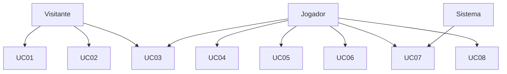

# Casos de uso

Projeto: Flesh to Chrome

## Atores

| Ator | Descrição |
| --- | --- |
| Visitante | Pessoa que abre o site sem login |
| Jogador | Usuário autenticado via provedor externo |
| Sistema | Backend, banco, e-mail, auditoria |

---

## UC01 — Acessar o site e carregar o jogo

- **Ator:** Visitante (ou Jogador)
- **Pré-condição:** ter navegador e internet
- **Fluxo principal:**
  1. Usuário acessa `https://nihil-legere-possum.lat`
  2. Frontend (HTML/JS do jogo) é baixado sob demanda
  3. O jogo carrega no canvas (Phaser)
  4. Usuário vê menu inicial
- **Alternativo:** falha de rede → mensagem de erro / tentar de novo

---

## UC02 — Autenticar com Google

- **Ator:** Visitante
- **Pré-condição:** frontend carregado; provedor OAuth configurado
- **Fluxo principal:**
  1. Usuário clica em “Entrar com Google”
  2. Sistema redireciona / abre fluxo OAuth
  3. Provedor autentica
  4. Backend cria ou atualiza usuário no banco
  5. Sessão/token fica disponível pro frontend
  6. Sistema registra evento de login (auditoria)
  7. Sistema pode enviar e-mail de boas-vindas (primeira vez)
- **Alternativo:** usuário cancela no Google → volta ao menu sem login

---

## UC03 — Jogar fase (correr, morrer, checkpoint)

- **Ator:** Visitante ou Jogador
- **Pré-condição:** jogo carregado; fase disponível
- **Fluxo principal:**
  1. Usuário inicia / continua a fase
  2. Alex corre automaticamente
  3. Usuário usa pulo/slide (e habilidades se tiver implante)
  4. Ao passar checkpoint, progresso local da fase atualiza
  5. Ao terminar a fase, segue pra clínica ou próxima etapa
- **Alternativo A — morte:**
  1. Colisão letal
  2. Perde créditos não consolidados
  3. Reinicia do último checkpoint
- **Alternativo B — sair no meio:** progresso só persiste de forma confiável se for Jogador autenticado (UC04)

---

## UC04 — Salvar e carregar progresso

- **Ator:** Jogador
- **Pré-condição:** autenticado
- **Fluxo principal (salvar):**
  1. Frontend envia estado relevante pra API (fase, implantes, créditos, caminho)
  2. Backend valida e grava no banco
  3. Sistema registra operação crítica de save
  4. Frontend confirma sucesso
- **Fluxo principal (carregar):**
  1. Após login (ou ao abrir campanha), frontend pede save
  2. Backend devolve save da conta
  3. Jogo restaura estado
- **Alternativo:** API indisponível → avisa o usuário; não corrompe save antigo

---

## UC05 — Clínica / aceitar implante

- **Ator:** Jogador (idealmente autenticado pra persistir)
- **Pré-condição:** acabou de concluir Fase 1, 2, 3 ou 4
- **Fluxo principal:**
  1. Jogo abre cena da clínica (George Vektor)
  2. Jogador aceita o procedimento
  3. Implante correspondente é marcado no estado do jogo
  4. Habilidade nova é liberada
  5. Se autenticado, save é atualizado (UC04)
- **Observação:** ordem dos implantes é fixa (ver regras de negócio)

---

## UC06 — Escolha no Portão

- **Ator:** Jogador
- **Pré-condição:** chegou ao Portão (Fase 5)
- **Fluxo principal:**
  1. Sistema apresenta escolha: aceitar conversão ou recusar
  2. Jogador escolhe
  3. Save registra o ramo (Chrome ou descida)
  4. Sistema registra operação crítica
  5. Jogo segue pro final / descida correspondente
- **Alternativo:** jogador fecha o jogo antes de confirmar → escolha não consolidada no backend

---

## UC07 — Receber e-mail / notificação

- **Ator:** Jogador / Sistema
- **Pré-condição:** usuário autenticado com e-mail disponível pelo provedor
- **Fluxo principal (exemplo — boas-vindas):**
  1. Primeiro login bem-sucedido
  2. Backend dispara envio de e-mail
  3. Usuário recebe mensagem
- **Outros gatilhos possíveis:** marco de progresso (ex. concluiu setor), aviso de conta — a gente define os gatilhos finais na implementação
- **Alternativo:** falha no provedor de e-mail → log de erro; não impede jogar

---

## UC08 — Consultar registros de auditoria

- **Ator:** Jogador (próprios eventos) e/ou perfil administrativo do time, se existir
- **Pré-condição:** autenticado; eventos já registrados
- **Fluxo principal:**
  1. Usuário (ou admin) solicita histórico de operações críticas
  2. Backend filtra e devolve lista (login, saves, escolha do Portão, etc.)
  3. Interface mostra os registros
- **Obs.:** na prática da disciplina, o importante é **existir o registro**; a tela de consulta pode ser simples (até endpoint documentado + listagem básica)

---

## Diagrama resumido de atores × casos

