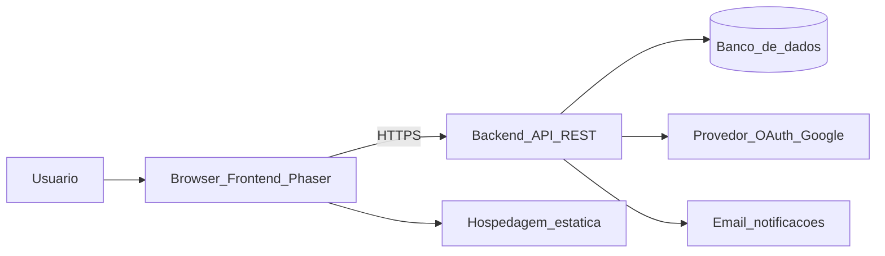
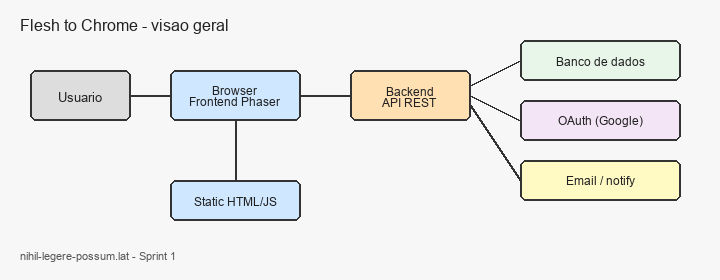
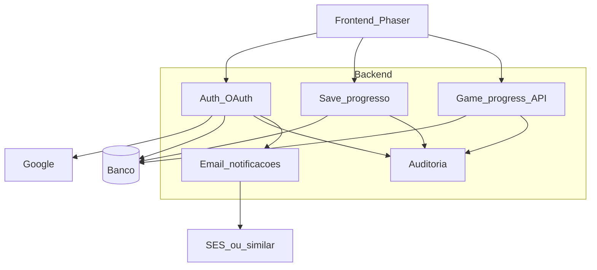
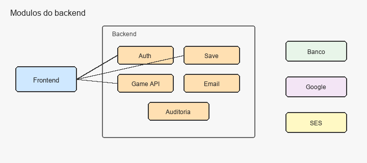
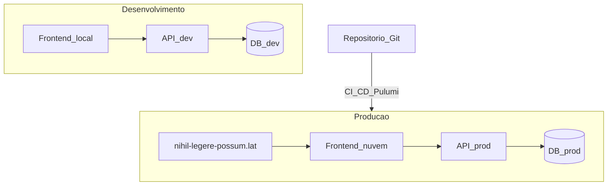
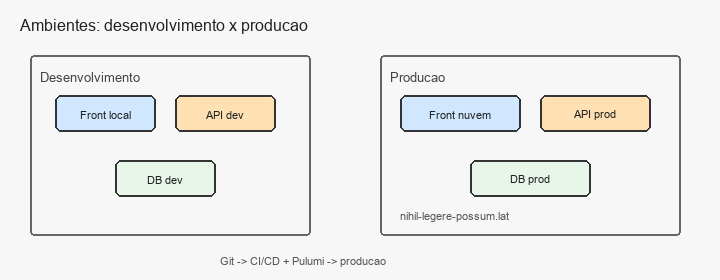

# Diagramas de blocos

Projeto: Flesh to Chrome  
Sprint 1 — visão de arquitetura (ainda pode mudar na implementação)

As figuras estão em PNG em [`../imagens/`](../imagens/) (abrimos direto no GitHub/Preview). Também tem o Mermaid abaixo pra quem quiser editar fácil.

---

## 1. Visão geral — cliente, servidor e nuvem

O browser baixa o frontend e fala com a API. A API usa banco, OAuth e serviço de e-mail. Em produção isso vive na AWS.

---

## 2. Módulos do backend

Separação bem direta do que a API precisa ter pra atender a disciplina + o jogo:

Resumo do que cada bloco faz:

| Módulo | Função |
| --- | --- |
| Auth | login/logout com Google, sessão/token |
| Save | grava/lê progresso da campanha |
| Game progress | endpoints ligados a estado do jogo (fase, implante, Portão) |
| E-mail | boas-vindas e avisos |
| Auditoria | log de operações críticas |

---

## 3. Ambientes: desenvolvimento × produção

- **Dev:** pra testar sem gastar / sem quebrar produção.  
- **Prod:** domínio público, subida automática com CI/CD + IaC (Pulumi), região padrão da disciplina `sa-east-1`.

---

## Observação

Isso é diagrama de blocos da Sprint 1. Nomes exatos de serviços AWS (S3, CloudFront, ECS, RDS, etc.) a gente fecha quando for montar o Pulumi de verdade.
