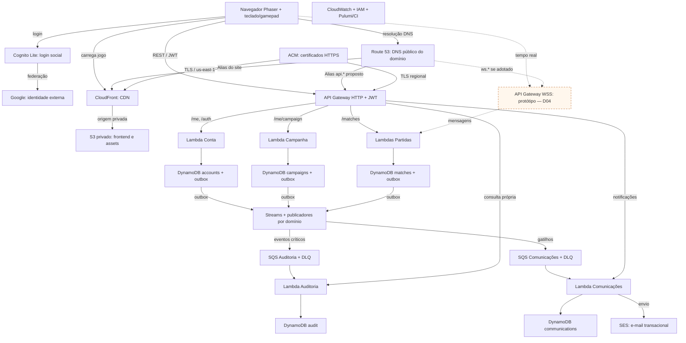
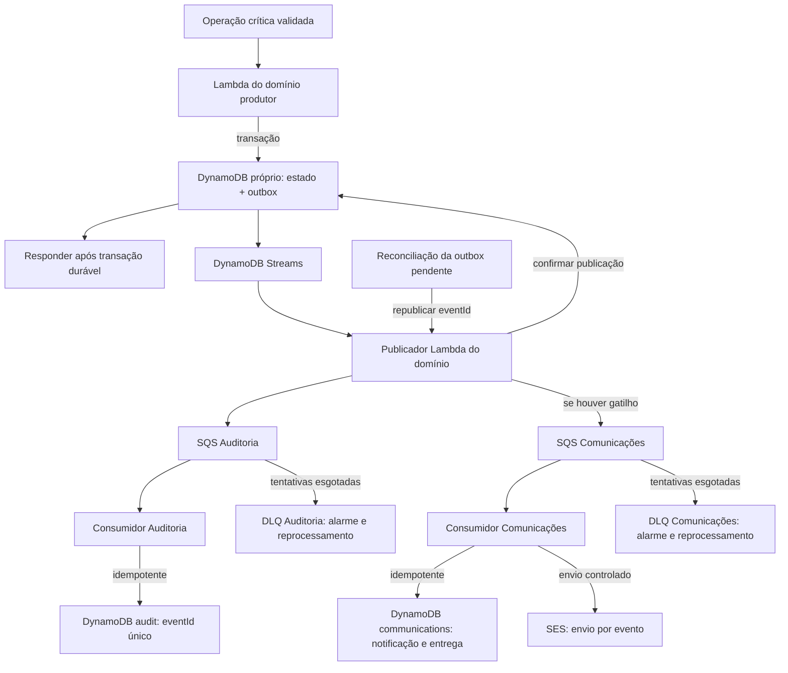
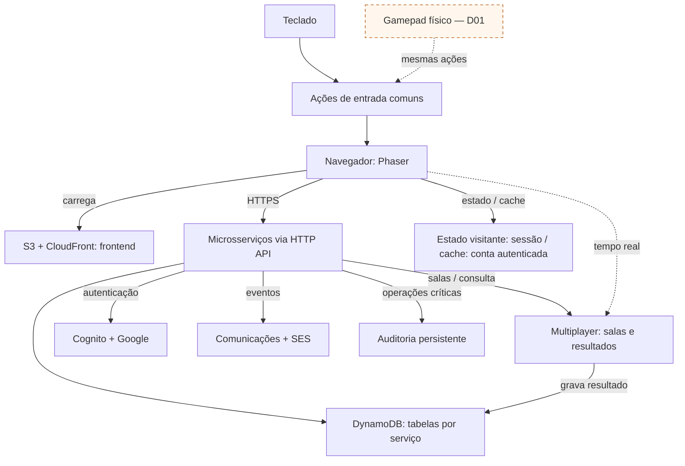
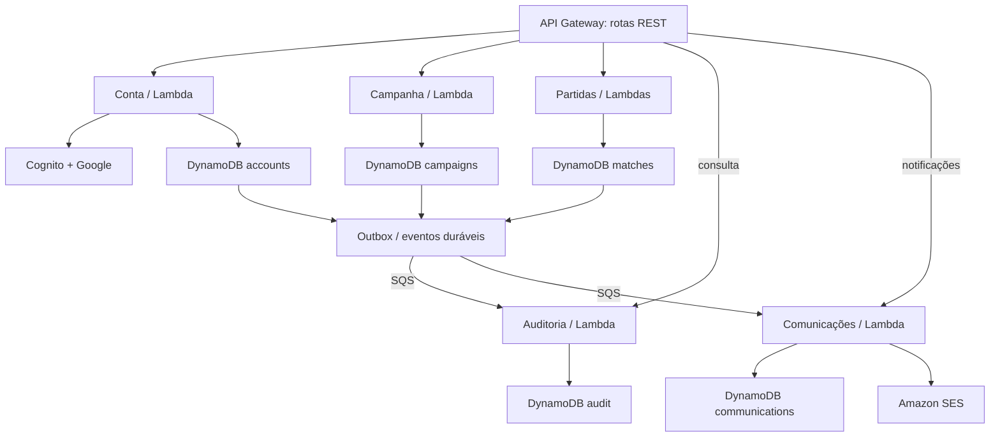
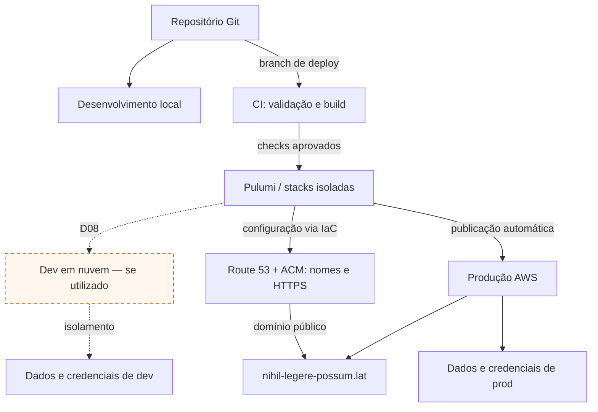
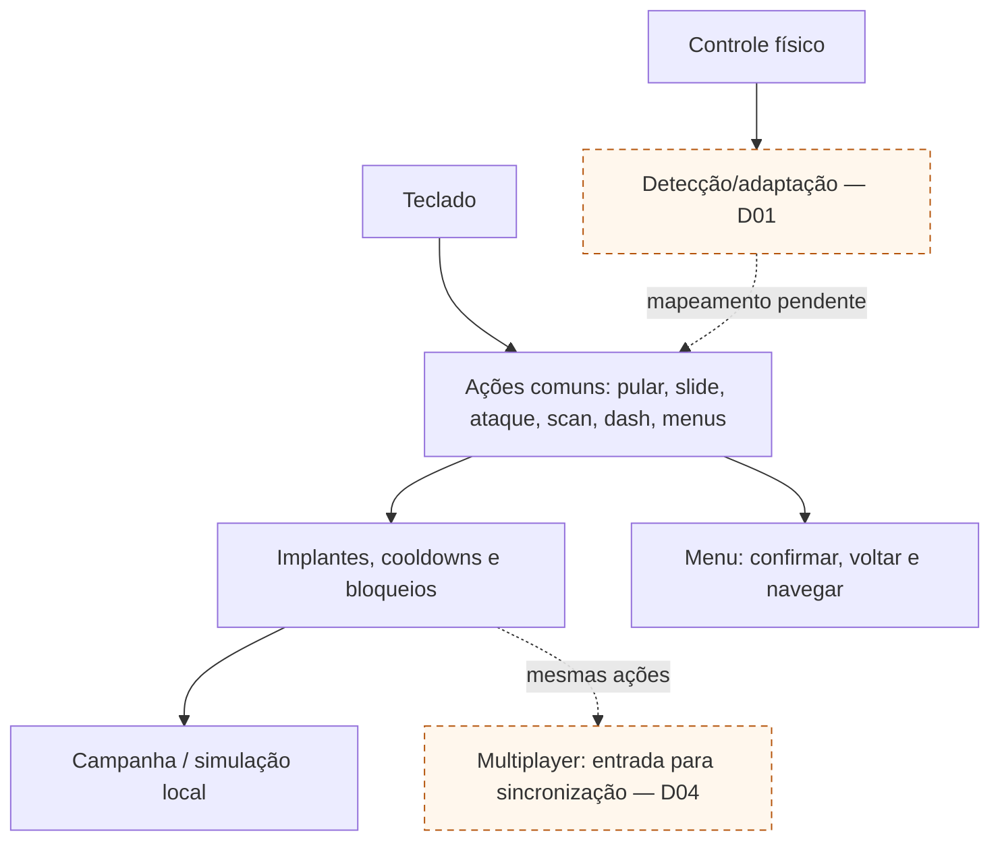
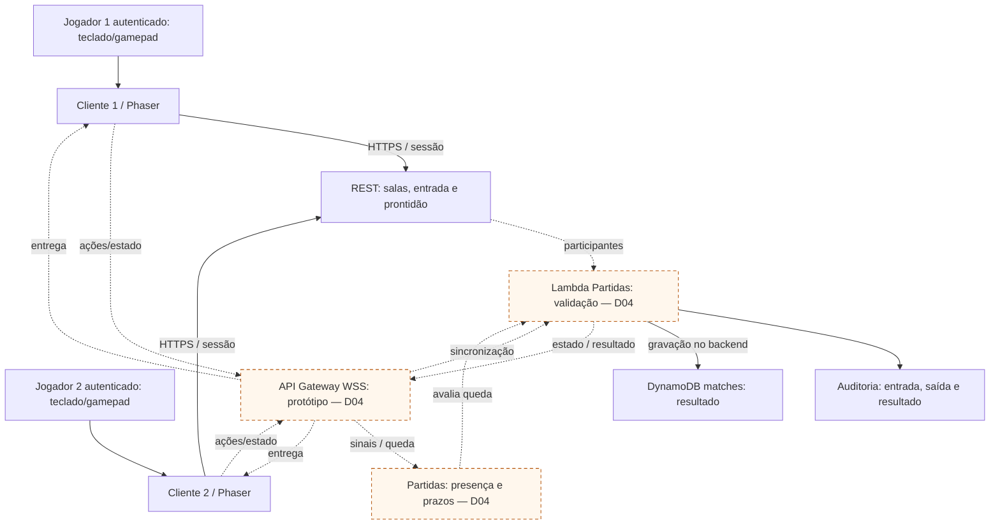
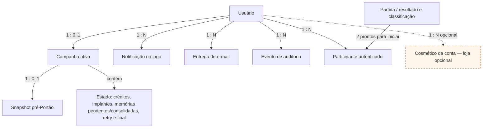

# Diagramas de arquitetura e dados

Projeto: **Flesh to Chrome** — especificação da Sprint 1.

Fonte única: [`../diagramas.json`](../diagramas.json). Mermaid e SVG abaixo são gerados por `python3 isn/scripts/gerar_diagramas.py` a partir da raiz do repositório. Não editar as versões geradas separadamente.

Os diagramas descrevem o sistema planejado, não comprovam implementação. Propostas e decisões pendentes têm rótulo Dxx e/ou traço pontilhado; ver [registro de decisões](07-decisoes-pendentes.md).

## 1. AWS — microsserviços e serviços gerenciados

Arquitetura de referência: implantação e dados próprios para Conta, Campanha, Partidas, Comunicações e Auditoria. Blocos com múltiplas tabelas são agrupamentos visuais, não banco compartilhado entre serviços. Cada domínio acessa apenas seus dados. Tempo real é candidato D04. Conta AWS ainda não criada; Free Tier e orçamento no documento 12. Route 53 resolve nomes para os destinos; suas setas são registros DNS, não passagem de tráfego HTTP. ACM fornece certificados. api.* e ws.* são nomes propostos (D08/D04); detalhes e custos no documento 12, seção 3.1. Documento 13 recomenda WSS para o protótipo; API Gateway/Lambda segue em validação. Heartbeat não estende o limite de 2 h; renovar no lobby. D03/D07 aprovadas: salas privadas por código/link, central de notificações e feedback SES/SNS/SQS no documento 14. Compra notifica apenas no jogo, sem e-mail.

## 2. AWS — eventos, auditoria e notificações

Fluxo proposto por serviço produtor: mudança e outbox na mesma transação. Streams ativa publicador; SQS e consumidores permitem retentativas. Destinos deduplicam eventId; falhas repetidas vão para DLQ. Outbox preservada permite reconciliar publicação perdida. SES não bloqueia save e Streams não substitui armazenamento permanente. D07 aprovada no documento 14 define categorias/preferências e feedback de entrega SES via SNS/SQS, detalhado no fluxo de comunicações.

## 3. Visão geral — jogo, serviços e nuvem

Visão de contexto; detalhamento físico nos diagramas AWS. Conta, Campanha, Partidas, Auditoria e Comunicações são microsserviços independentes em Lambda, com tabelas DynamoDB próprias. S3/CloudFront entregam o jogo; Cognito/Google autenticam. Sincronização multiplayer continua sujeita à prova D04. D06: visitante joga somente na sessão, sem save persistente; login permite vincular progresso à conta conforme D05, sem histórico retroativo.

## 4. Microsserviços do backend e seus dados

Cada serviço tem Lambda(s), IAM role, pacote e tabela próprios, com implantação independente. As conexões de eventos representam outbox/publicação por filas, detalhadas no diagrama AWS de eventos. Não há leitura direta da tabela de outro serviço. Identidade e e-mail são terceirizados para Cognito/Google e SES. Se a loja for implementada, Campanha também mantém aquisições por conta em itens separados do save; débito/desbloqueio/outbox consistentes, sem acesso à tabela Conta (D11; documentos 08/09).

## 5. Ambientes e implantação

Pulumi mantém base e serviços independentes por ambiente. Dev local é padrão; dev em nuvem é temporário e isolado de produção. AWS gerenciada/Lambda/DynamoDB são a base; conta ainda não criada, com elegibilidade, capacidade e orçamento em D08. Não provisionar compute ocioso como requisito de microsserviços. Base DNS/HTTPS compartilhada via Route 53 e ACM; subdomínios de dev não exigem nova zona pública.

## 6. Entrada por teclado e gamepad físico

Controle físico confirmado. D01 cobre botões, compatibilidade e vários controles. D02 aprovada: desconexão pausa campanha com retomada explícita pelo controle/teclado; multiplayer segue sem pausa e com aviso. Teclado e gamepad usam as mesmas restrições do gameplay; não existe celular remoto neste desenho.

## 7. Multiplayer — salas, sincronização e resultado

Dois navegadores com jogadores autenticados, criação/entrada em sala e resultado/classificação persistidos. D03 aprovada: código/link privado, convite de 10 min, uma partida ativa por conta, reserva atômica da segunda vaga e histórico privado de 30 dias. Cancelar sala se alguém sair antes da largada. Não há ranking global nem busca pública inicial. API Gateway HTTP, Lambda Partidas e DynamoDB próprio atendem salas/resultados. WSS é recomendado para o protótipo; API Gateway/Lambda, autoridade, presença e prazos de rede seguem em D04. Renovar conexão no lobby; não retomar corrida após derrota. Ver documentos 12–14.

## 8. Modelo lógico — cardinalidades e separação de dados

Detalhes no documento 08. D05 aprova isolamento por conta. D10 separa memória pendente e consolidada pela retirada. D11 aprova aquisições cosméticas por conta, independentes de campanha/snapshot/reset; loja continua opcional. Proposta física: itens de aquisições separados na tabela do serviço Campanha, para débito/desbloqueio/outbox consistentes. D03/D07 aprovadas: histórico privado e central por conta, ambos com 30 dias de exibição; deduplicação tem retenção própria. Implementação da loja permanece opcional. Compra não gera entrega de e-mail. D06: Campanha persistente pertence apenas à conta autenticada; visitante não gera registro e perde progresso ao fechar/recarregar. Importação registra estado atual, sem histórico retroativo.

