# Diagramas de arquitetura e dados

Projeto: **Flesh to Chrome** — especificação da Sprint 1.

Fonte única: [`../diagramas.json`](../diagramas.json). Mermaid e SVG abaixo são gerados por `python3 isn/scripts/gerar_diagramas.py` a partir da raiz do repositório. Não editar as versões geradas separadamente.

Os diagramas descrevem o sistema planejado, não comprovam implementação. Propostas e decisões pendentes têm rótulo Dxx e/ou traço pontilhado; ver [registro de decisões](07-decisoes-pendentes.md).

## 1. AWS — microsserviços e serviços gerenciados

Arquitetura de referência: implantação e dados próprios para Conta, Campanha, Partidas, Comunicações e Auditoria. Blocos com múltiplas tabelas são agrupamentos visuais, não banco compartilhado entre serviços. Cada domínio acessa apenas seus dados. Tempo real é candidato D04. Conta AWS ainda não criada; Free Tier e orçamento no documento 12. Route 53 resolve nomes para os destinos; suas setas são registros DNS, não passagem de tráfego HTTP. ACM fornece certificados. api.* e ws.* são nomes propostos (D08/D04); detalhes e custos no documento 12, seção 3.1.

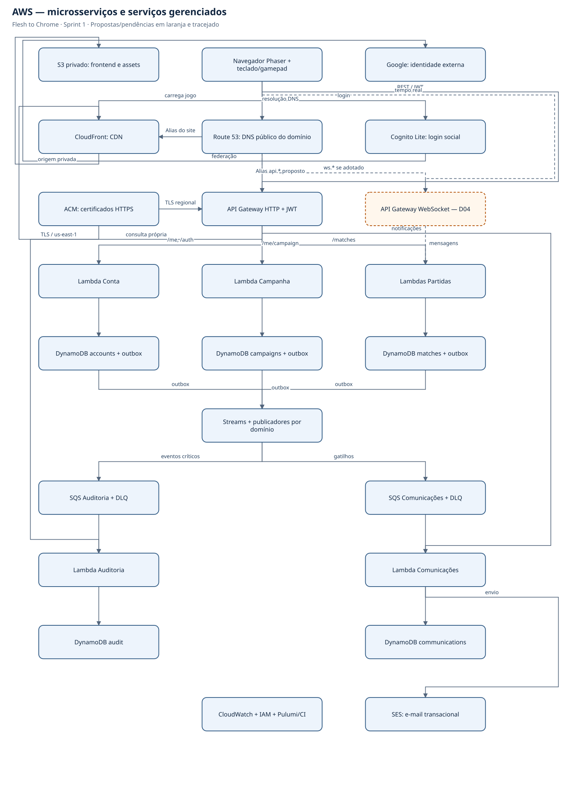

## 2. AWS — eventos, auditoria e notificações

Fluxo proposto por serviço produtor: mudança e outbox na mesma transação. Streams ativa publicador; SQS e consumidores permitem retentativas. Destinos deduplicam eventId; falhas repetidas vão para DLQ. Outbox preservada permite reconciliar publicação perdida. SES não bloqueia save e Streams não substitui armazenamento permanente.

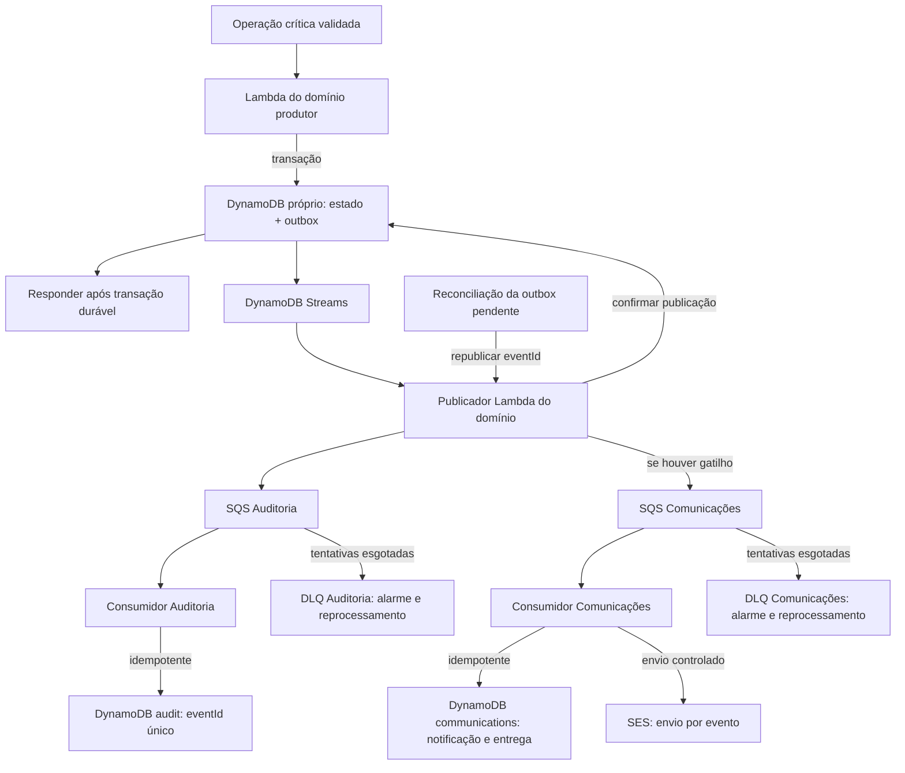

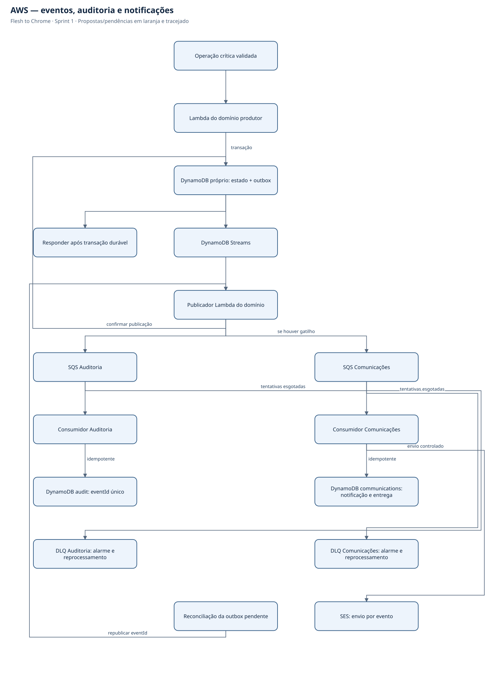

## 3. Visão geral — jogo, serviços e nuvem

Visão de contexto; detalhamento físico nos diagramas AWS. Conta, Campanha, Partidas, Auditoria e Comunicações são microsserviços independentes em Lambda, com tabelas DynamoDB próprias. S3/CloudFront entregam o jogo; Cognito/Google autenticam. Sincronização multiplayer continua sujeita à prova D04.

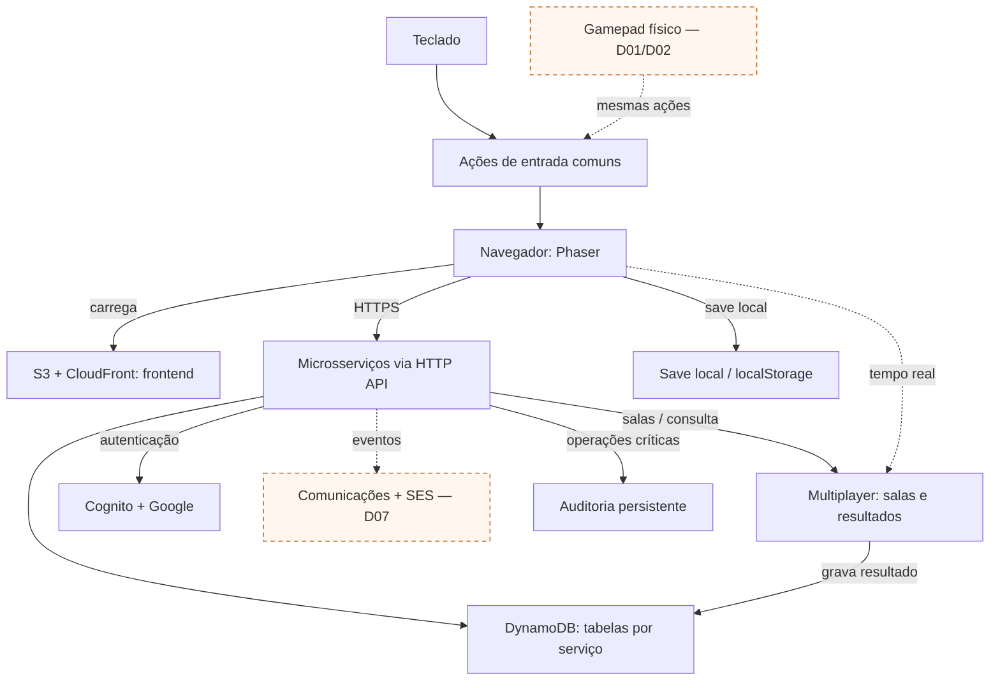

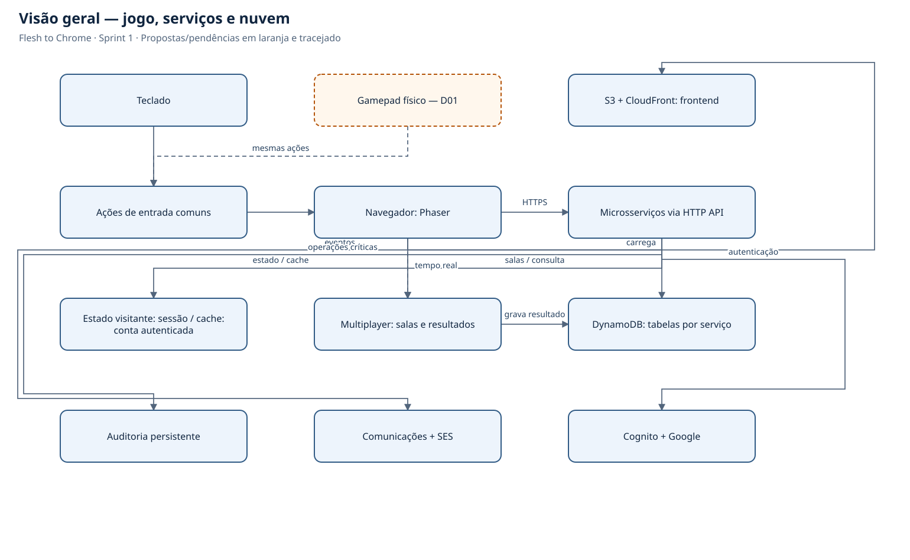

## 4. Microsserviços do backend e seus dados

Cada serviço tem Lambda(s), IAM role, pacote e tabela próprios, com implantação independente. As conexões de eventos representam outbox/publicação por filas, detalhadas no diagrama AWS de eventos. Não há leitura direta da tabela de outro serviço. Identidade e e-mail são terceirizados para Cognito/Google e SES.

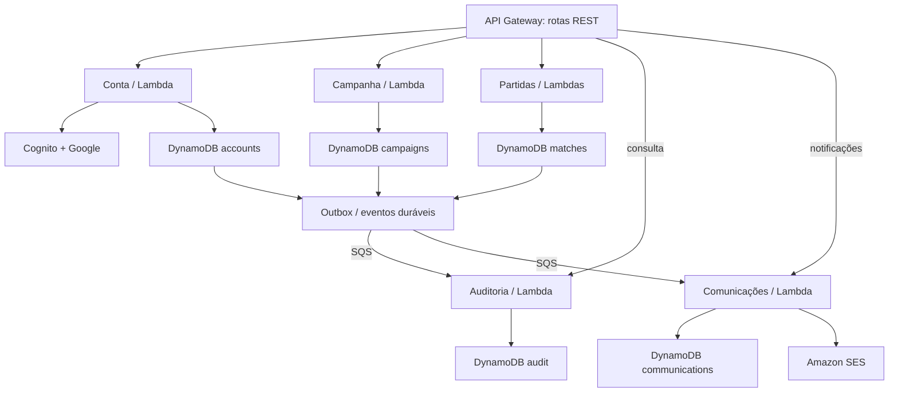

## 5. Ambientes e implantação

Pulumi mantém base e serviços independentes por ambiente. Dev local é padrão; dev em nuvem é temporário e isolado de produção. AWS gerenciada/Lambda/DynamoDB são a base; conta ainda não criada, com elegibilidade, capacidade e orçamento em D08/D09. Não provisionar compute ocioso como requisito de microsserviços. Base DNS/HTTPS compartilhada via Route 53 e ACM; subdomínios de dev não exigem nova zona pública.

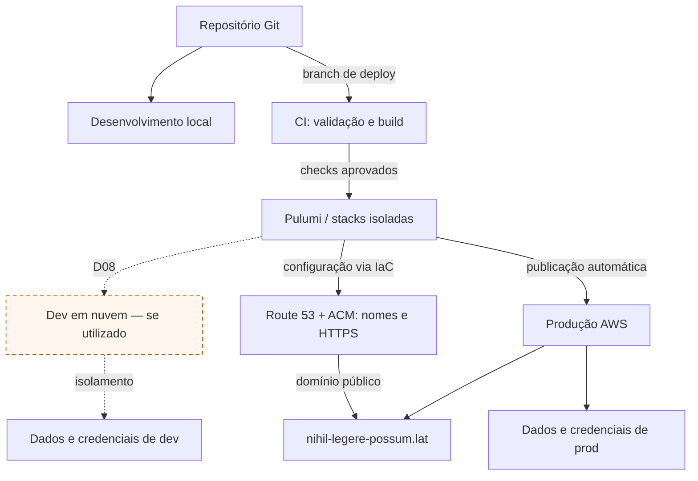

## 6. Entrada por teclado e gamepad físico

Controle físico é escopo confirmado. Botões, compatibilidade, vários controles e desconexão estão em D01/D02. Não existe celular remoto neste desenho. Teclado continua disponível e ambos usam as mesmas restrições do gameplay.

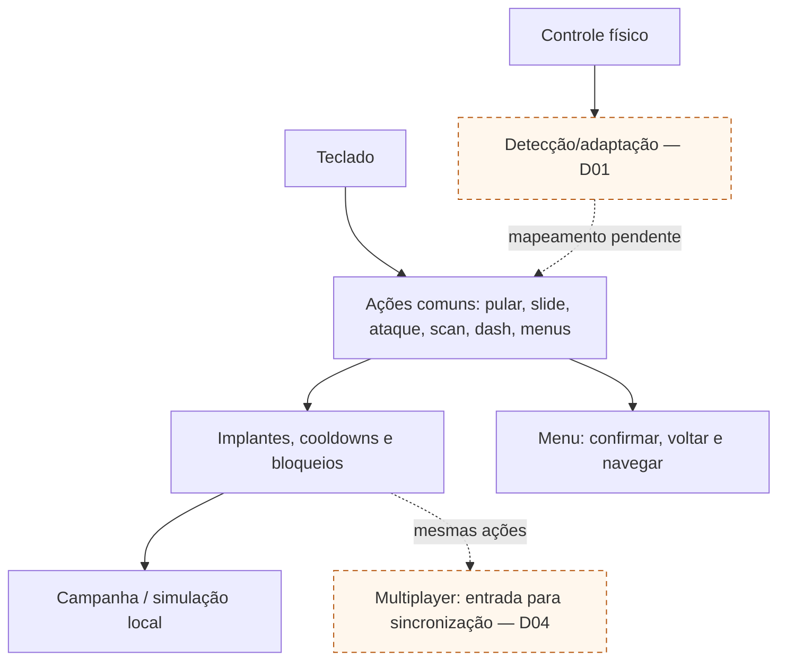

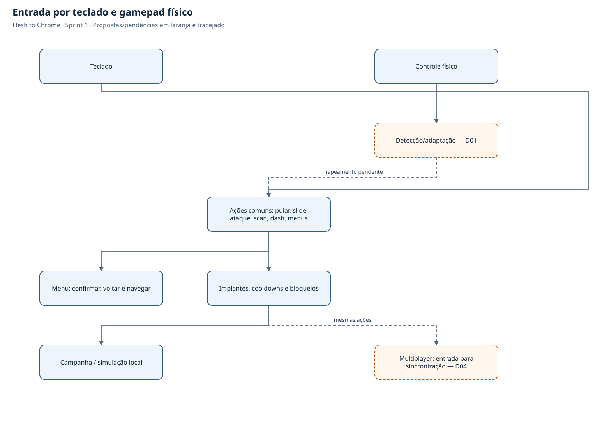

## 7. Multiplayer — salas, sincronização e resultado

ZIP RF22/RF23 e UC09 confirmam dois jogadores autenticados, criação/entrada em sala e resultado/classificação da corrida gravados. Dois navegadores são a topologia proposta. D03 ainda cobre descoberta/compartilhamento da sala e visibilidade/retenção; D04 cobre protocolo e autoridade. Ranking global não está definido. Implementação de referência: API Gateway HTTP para salas, Lambda Partidas e DynamoDB próprio para resultados. API Gateway WebSocket é candidato a validar em custo/latência; não enviar cada frame como save/auditoria. Ver documento 12.

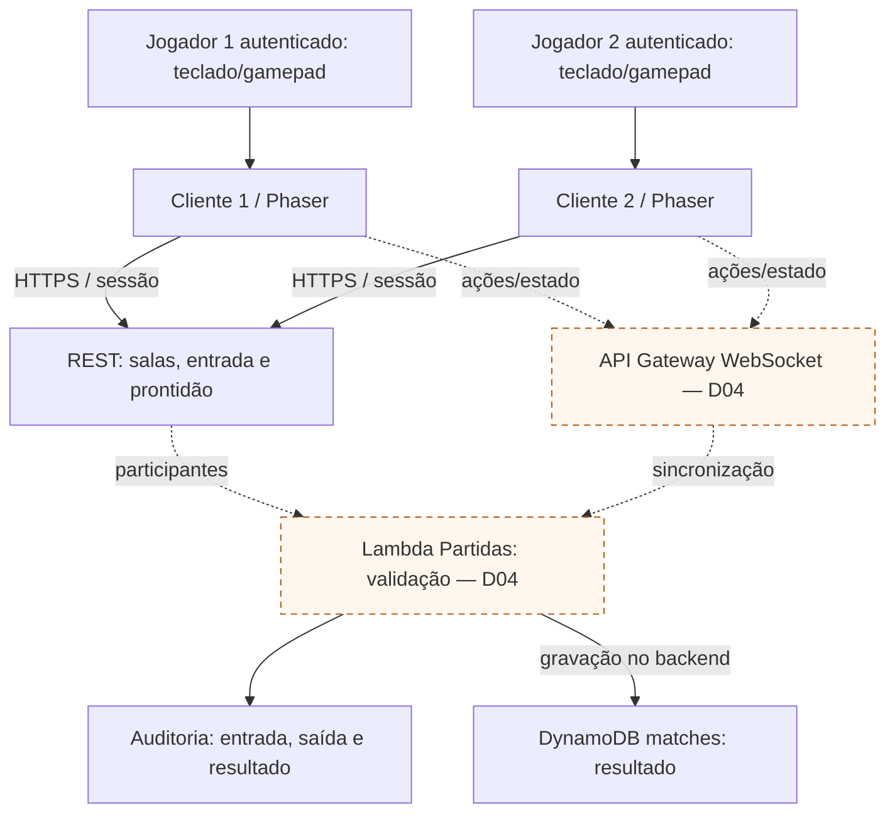

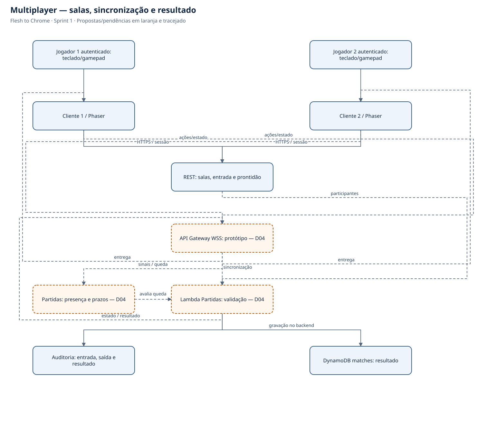

## 8. Modelo lógico — cardinalidades e separação de dados

Detalhes dos campos no documento 08. O ZIP confirma sala/partida, participantes autenticados e resultado persistido; formato dos dados é proposta de modelagem. Cosméticos são opcionais D11. Snapshot não é segundo slot. D03 cobre visibilidade/retenção dos resultados, não sua existência. O mapeamento físico agora usa tabelas DynamoDB por microsserviço, conforme documentos 08/12; linhas de relação não autorizam acesso cruzado entre serviços.

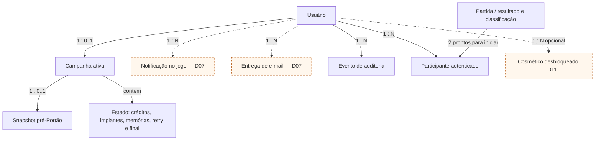

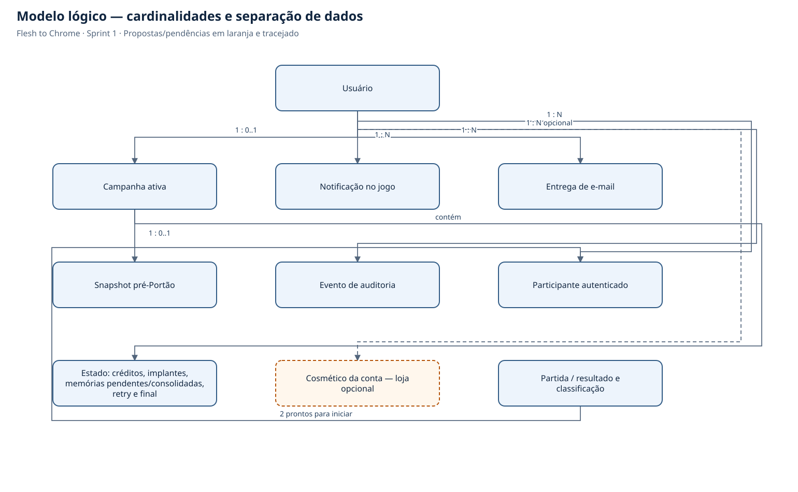
