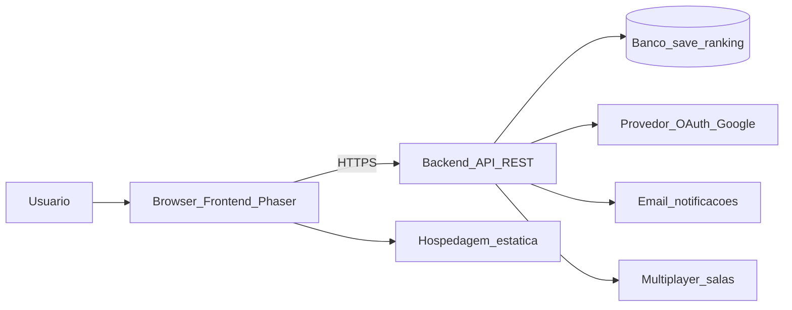
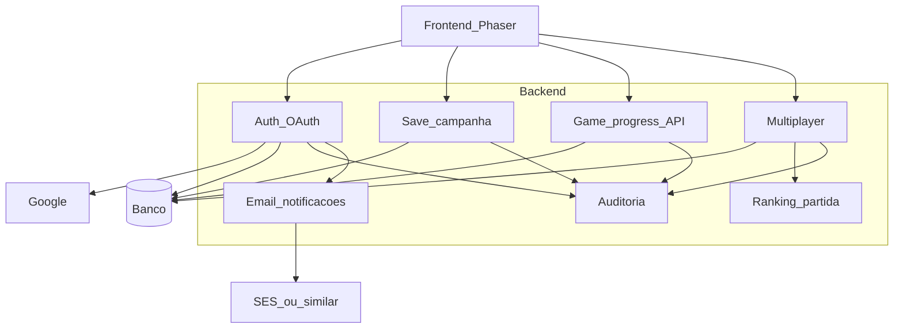
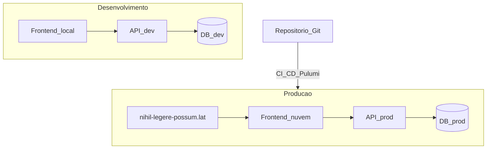

# Diagramas de blocos

Projeto: Flesh to Chrome  
Sprint 1 — visão de arquitetura (ainda pode mudar na implementação)

As figuras estão em PNG em [`../imagens/`](../imagens/). Também tem Mermaid pra editar fácil.

---

## 1. Visão geral — cliente, servidor e nuvem

O browser baixa o frontend e fala com a API. A API cuida de save da campanha, multiplayer/salas, OAuth e e-mail.

---

## 2. Módulos do backend

| Módulo | Função |
| --- | --- |
| Auth | login/logout com Google, sessão/token |
| Save | grava/lê progresso da campanha |
| Game progress | fase, implante, Portão |
| Multiplayer | salas / partida 1v1 |
| Ranking | resultado da corrida multiplayer |
| E-mail | boas-vindas e avisos |
| Auditoria | log de operações críticas |

---

## 3. Ambientes: desenvolvimento × produção

- **Dev:** pra testar sem gastar / sem quebrar produção.  
- **Prod:** domínio público, subida automática com CI/CD + IaC (Pulumi), região `sa-east-1`.

---

## Observação

Sprint 1 = diagrama de blocos. Nomes exatos de serviços AWS a gente fecha no Pulumi depois.
