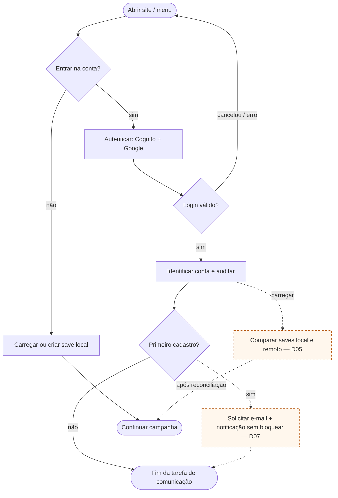
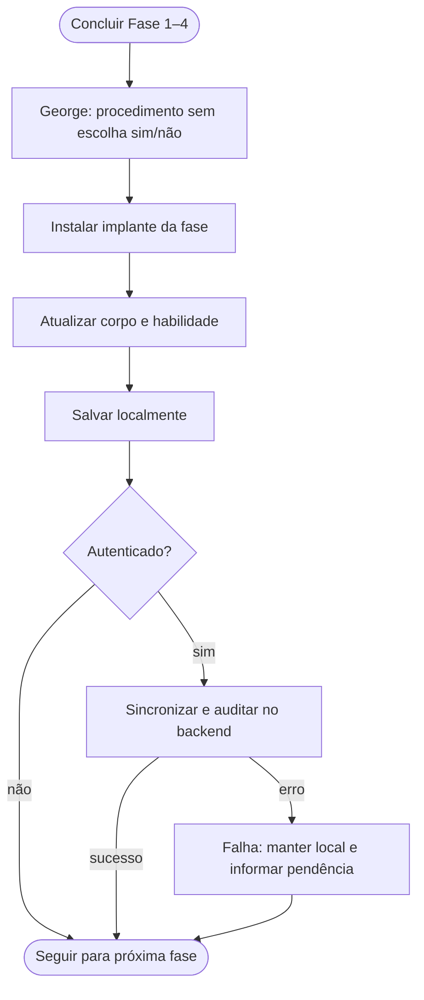
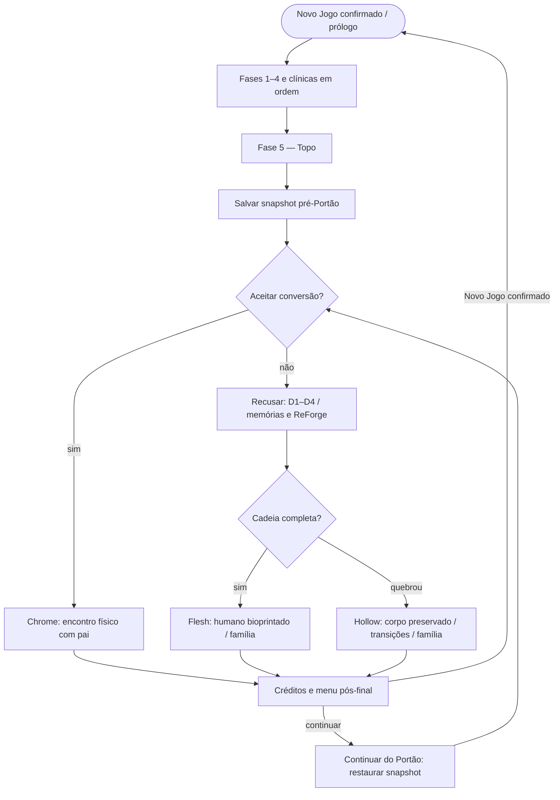
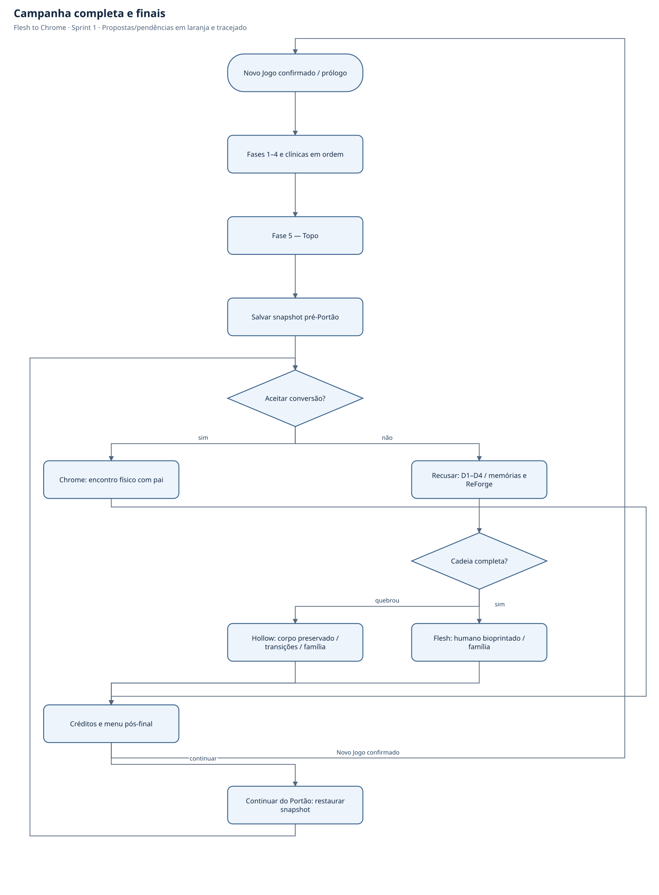
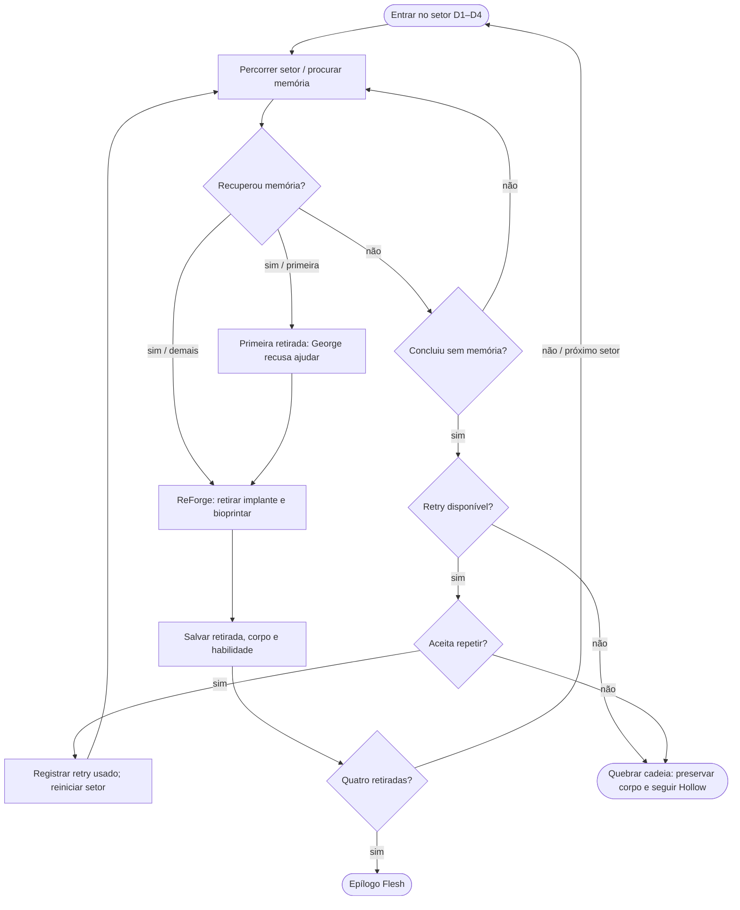
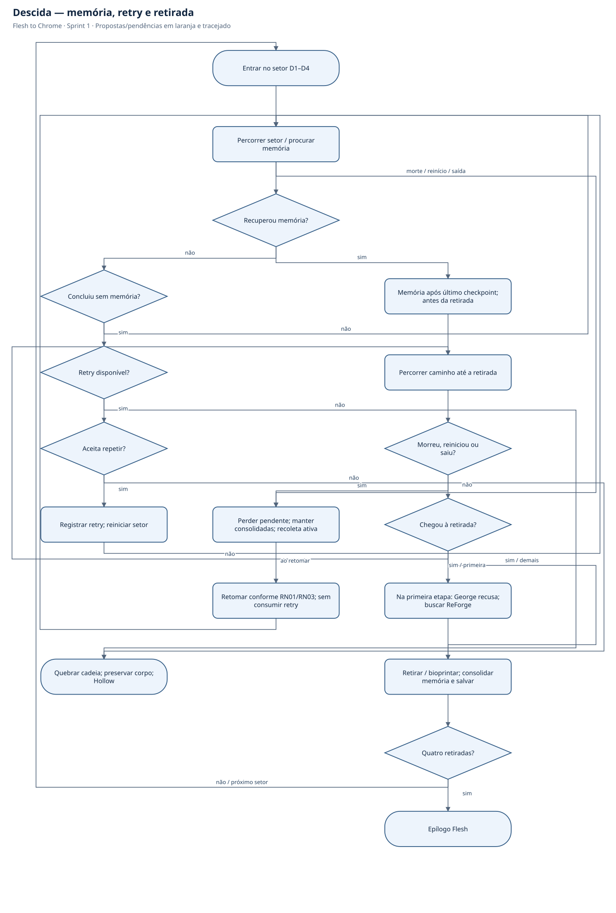
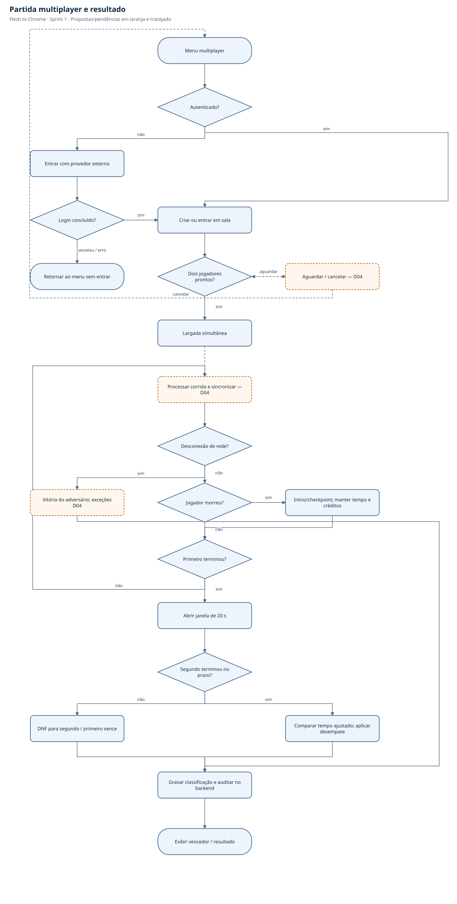
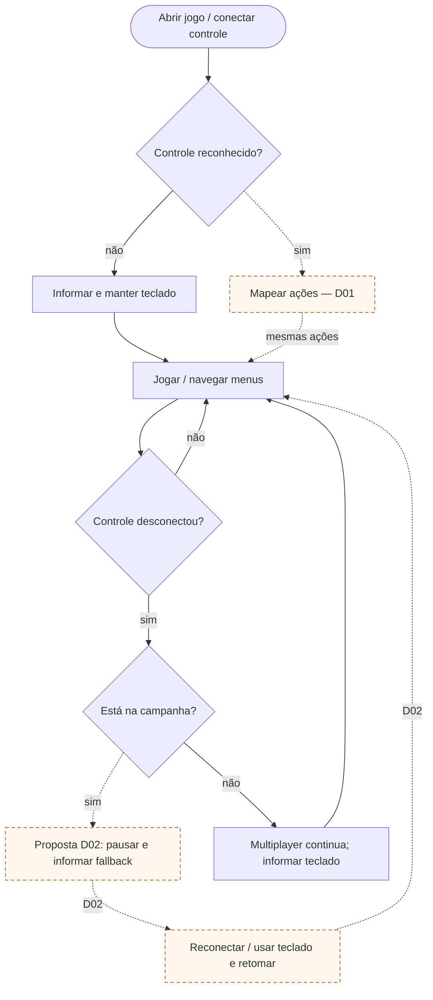
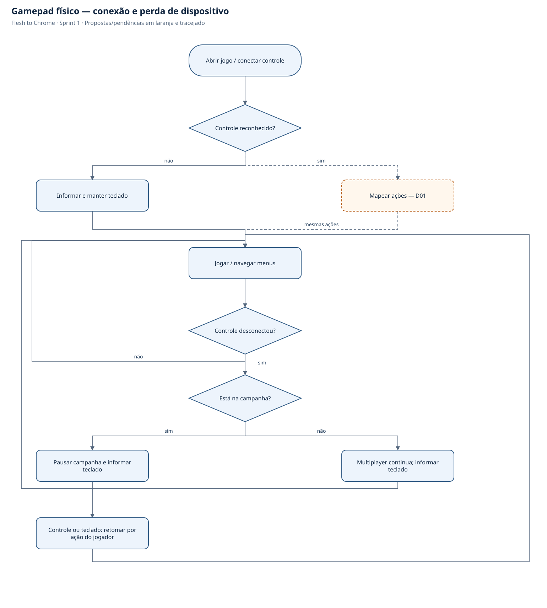

# Fluxogramas

Projeto: **Flesh to Chrome** — especificação da Sprint 1.

Fonte única: [`../diagramas.json`](../diagramas.json). Mermaid e SVG abaixo são gerados por `python3 isn/scripts/gerar_diagramas.py` a partir da raiz do repositório. Não editar as versões geradas separadamente.

Os diagramas descrevem o sistema planejado, não comprovam implementação. Propostas e decisões pendentes têm rótulo Dxx e/ou traço pontilhado; ver [registro de decisões](07-decisoes-pendentes.md).

## 1. Login, save local e comunicações

Primeiro cadastro, e não ausência de save, dispara boas-vindas. Login não é necessário para persistência local. D05 define reconciliação; envio de comunicação é independente e não bloqueia carregar a campanha.

## 2. Loop da fase e persistência

Checkpoint e fim de fase são avaliados mesmo sem obstáculos. Na campanha, créditos não consolidados se perdem na morte; o modo multiplayer usa a regra própria RN08. A descida não contém créditos comuns. Após morte, scan do trecho volta a oculto.

## 3. Clínica, implante e próxima fase

ZIP RF15 e UC05 esclarecem que o procedimento acontece sem escolha de aceitar/recusar. Aceitação de Alex é narrativa. Save local permanece conforme GDD; sincronização em nuvem só para autenticado, sem bloquear gameplay por falha de rede.

## 4. Campanha completa e finais

A descida usa a ordem e o retry do fluxo específico. Snapshot pré-Portão permanece separado; restauração integral permite repetir a escolha. Corpo de Hollow é o estado preservado na quebra, sem novas retiradas.

## 5. Descida — memória, retry e retirada

D1 Topo/propulsores → D2 Corporativo/olhos → D3 Urbano/braços → D4 Industrial/pernas. Apenas a conclusão do setor sem memória aciona a falha especial. Morte/reinício durante tentativa seguem RN03/RN06, sem consumir retry. D10 define persistência da memória antes do procedimento.

## 6. Partida multiplayer e resultado

Login dos dois participantes, criação/entrada em sala e resultado/classificação persistidos são definidos pelo ZIP. D03 cobre a descoberta da sala; D04 cobre protocolo e casos de cancelamento/desconexão. Durante a janela única de 20 s, o segundo continua sujeito a morte, checkpoint e desconexão. Resultado não altera campanha nem define ranking global.

## 7. Gamepad físico — conexão e perda de dispositivo

D01 define mapeamento/hardware; D02 propõe pausa automática na campanha. A desconexão física não declara derrota multiplayer: o jogador pode continuar pelo teclado e a partida não pausa.

## 8. Publicação automática de produção

Pipeline publica serviços alterados de forma independente; base compartilhada e contratos versionados em Pulumi. Dev em nuvem usa stack própria. A seleção de Lambda e serviços gerenciados reduz compute permanente; implantação depende de quotas/plano/custos confirmados para a conta ainda não criada. Pulumi gerencia zona/registros Route 53 e certificados ACM na base. A verificação pós-deploy inclui resolução DNS e HTTPS; nameservers dependem da delegação inicial no registrador.

