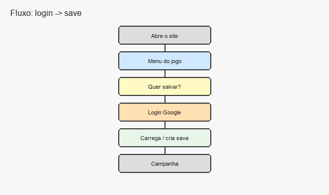
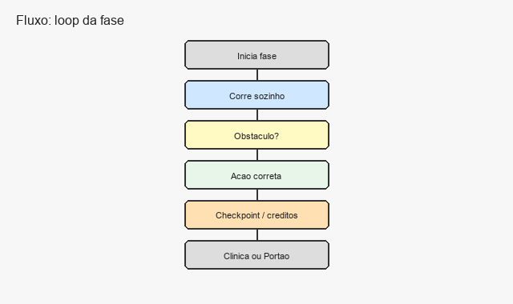
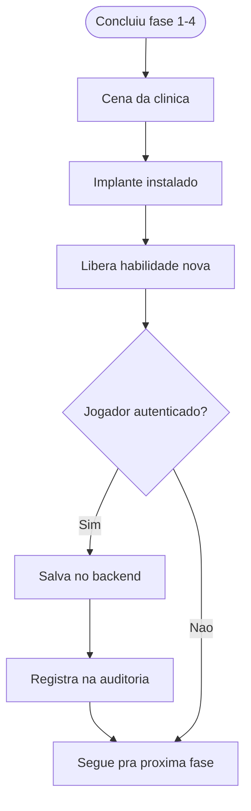
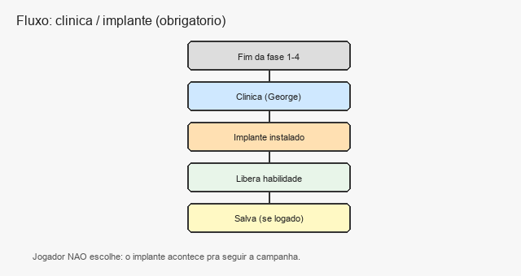
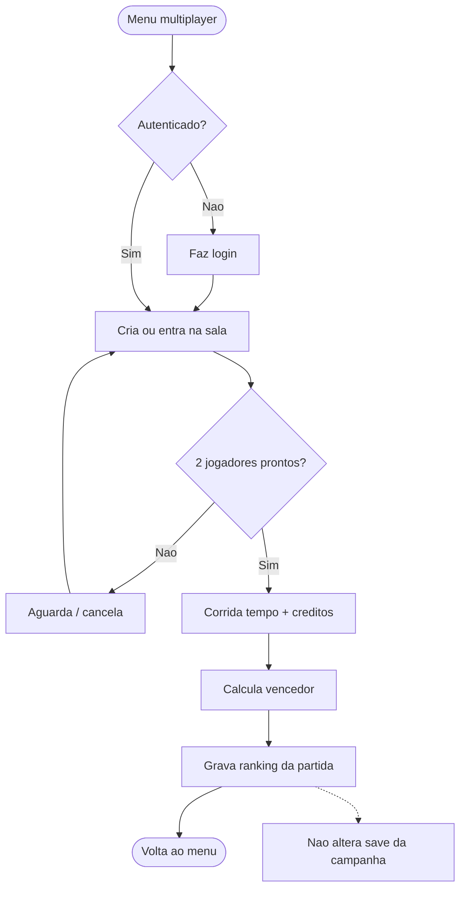
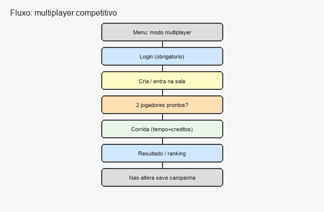
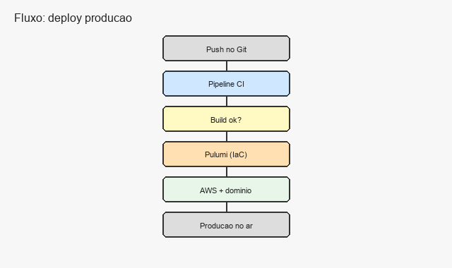

# Fluxogramas

Projeto: Flesh to Chrome  
Sprint 1

---

## 1. Login OAuth → sessão → carregar save

---

## 2. Loop de gameplay (fase)

---

## 3. Clínica → implante → habilidade (sem escolha)

O jogador **não escolhe** se coloca o implante. Depois da fase 1–4 o procedimento acontece e a habilidade é liberada.

---

## 4. Multiplayer competitivo

---

## 5. Deploy em produção (alto nível)

Esse fluxo é o alvo da disciplina (CI/CD + IaC). Na Sprint 1 a gente só especifica; a implementação vem depois.
