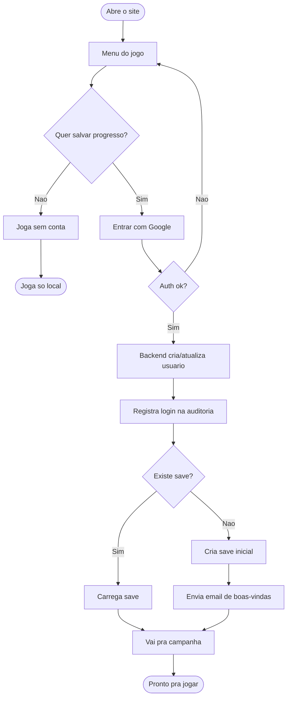
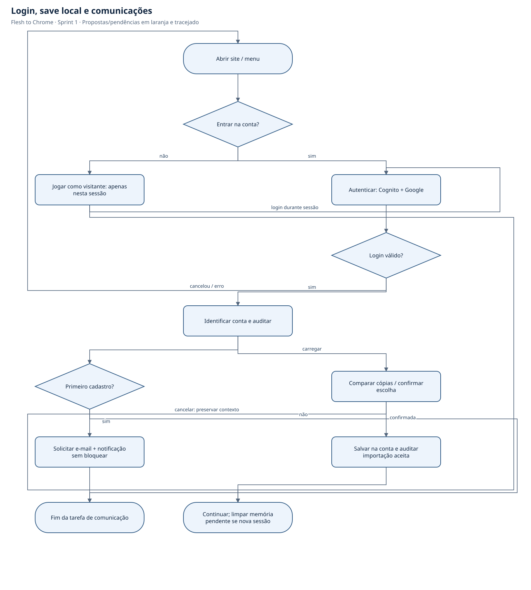
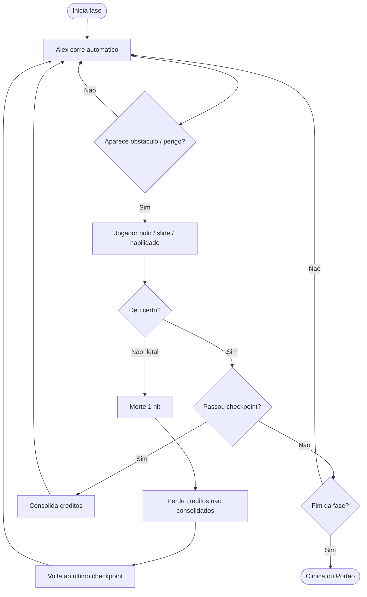
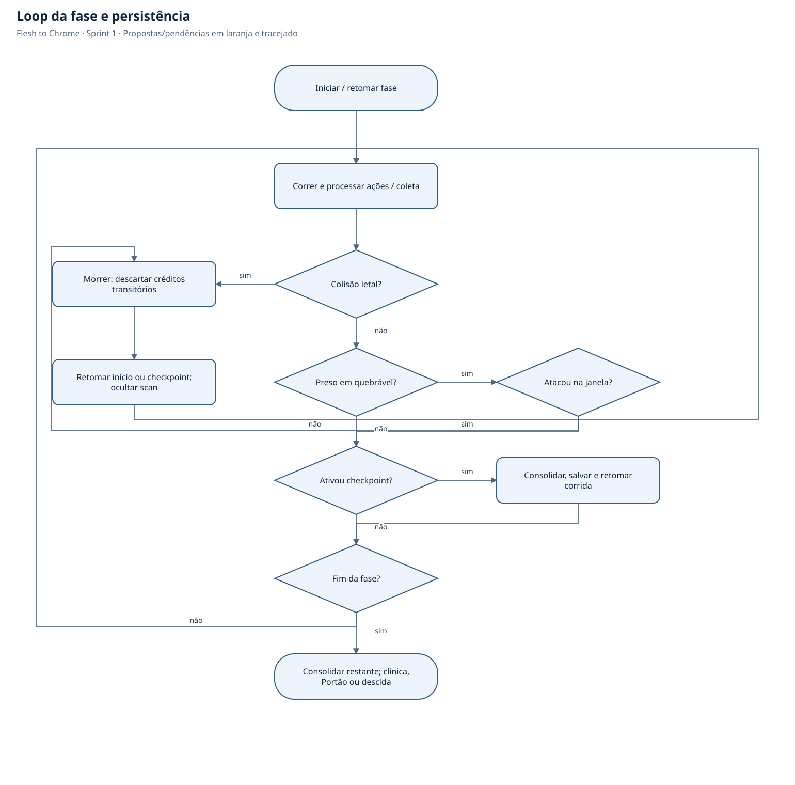
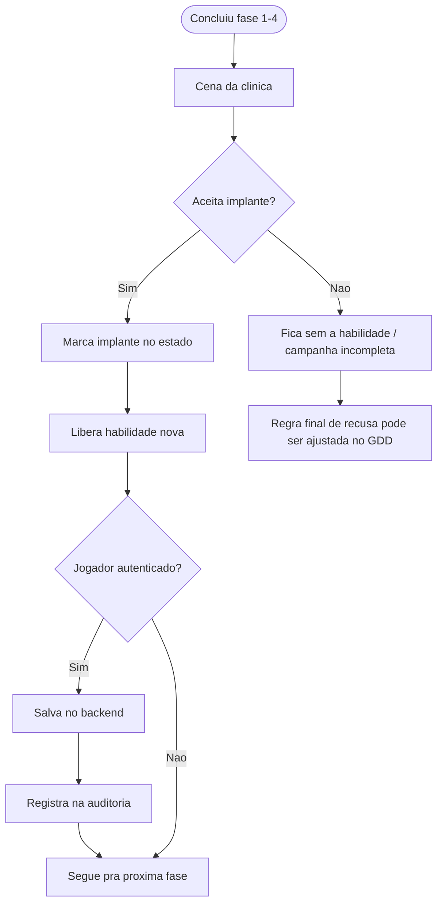
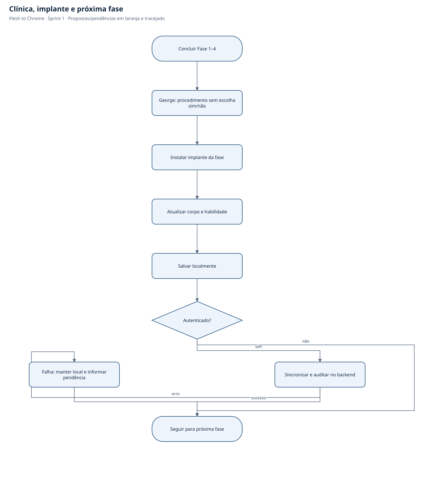
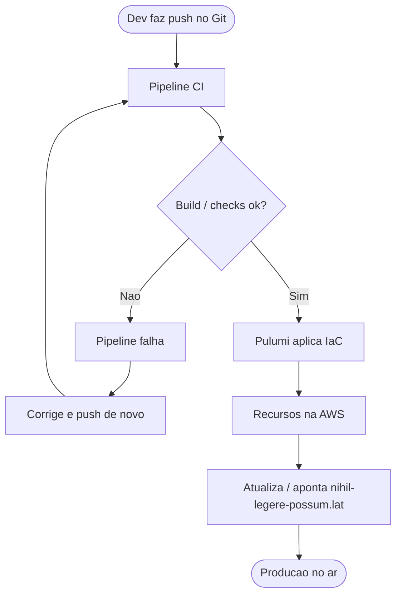

# Fluxogramas

Projeto: Flesh to Chrome  
Sprint 1

---

## 1. Login OAuth → sessão → carregar save

---

## 2. Loop de gameplay (fase)

---

## 3. Clínica → implante → habilidade

---

## 4. Deploy em produção (alto nível)

Esse fluxo é o alvo da disciplina (CI/CD + IaC). Na Sprint 1 a gente só especifica; a implementação vem depois.
