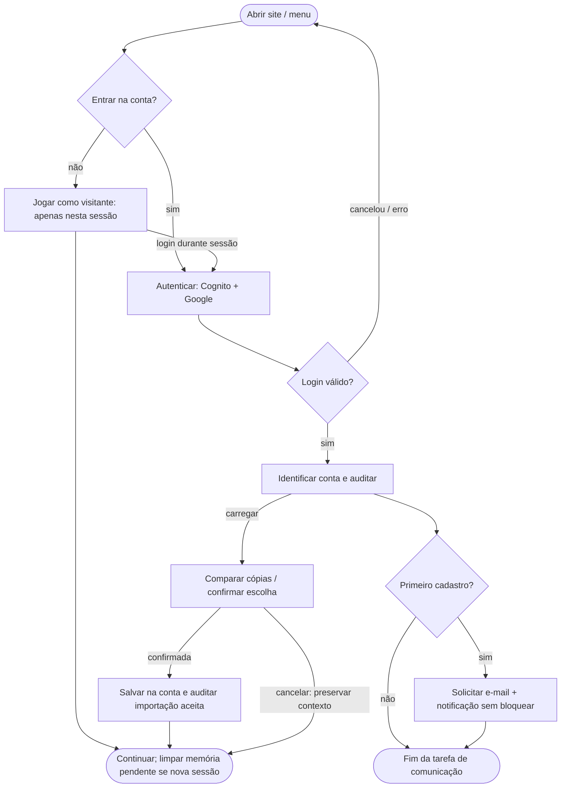
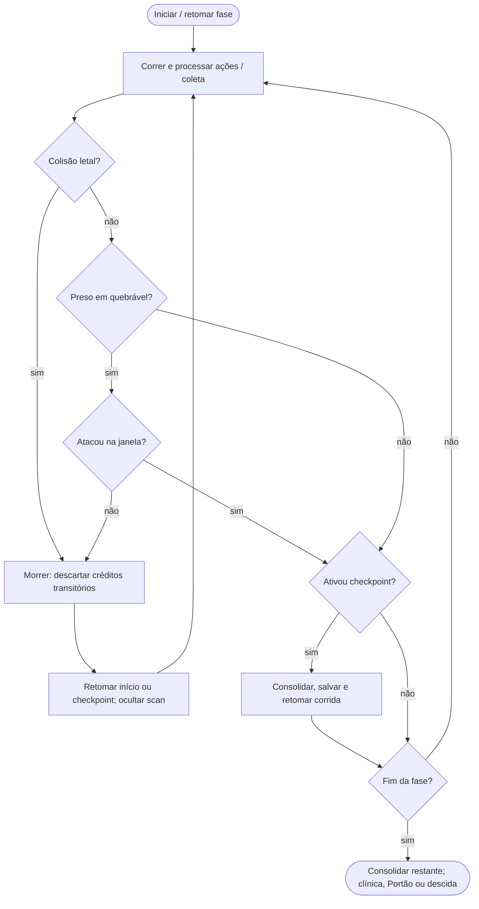
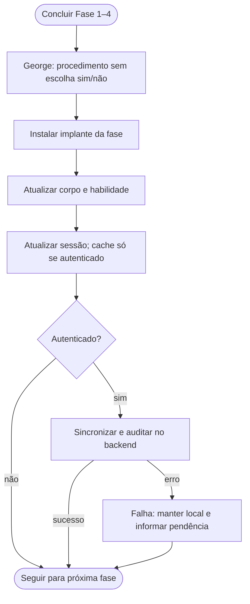
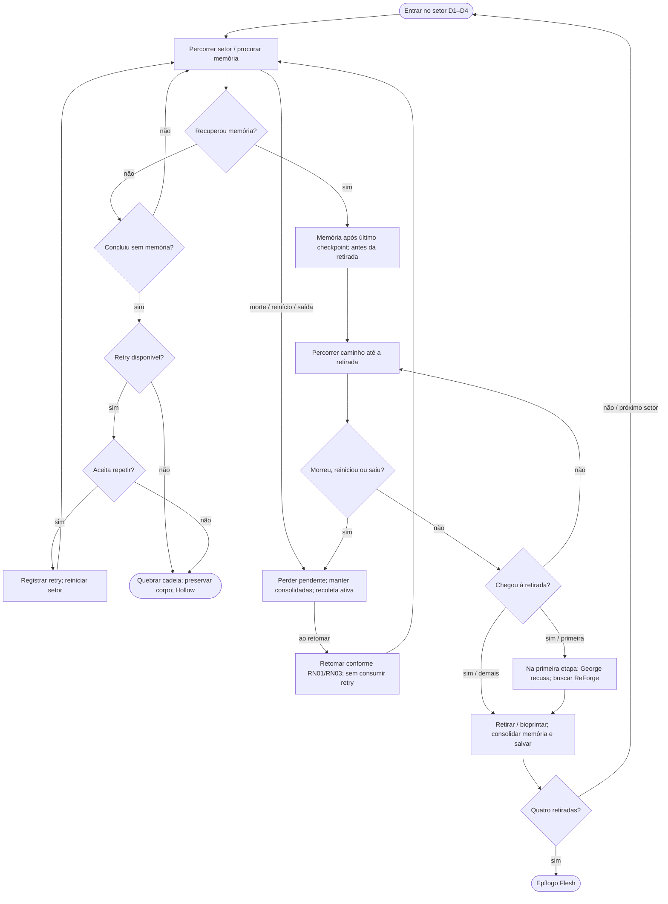
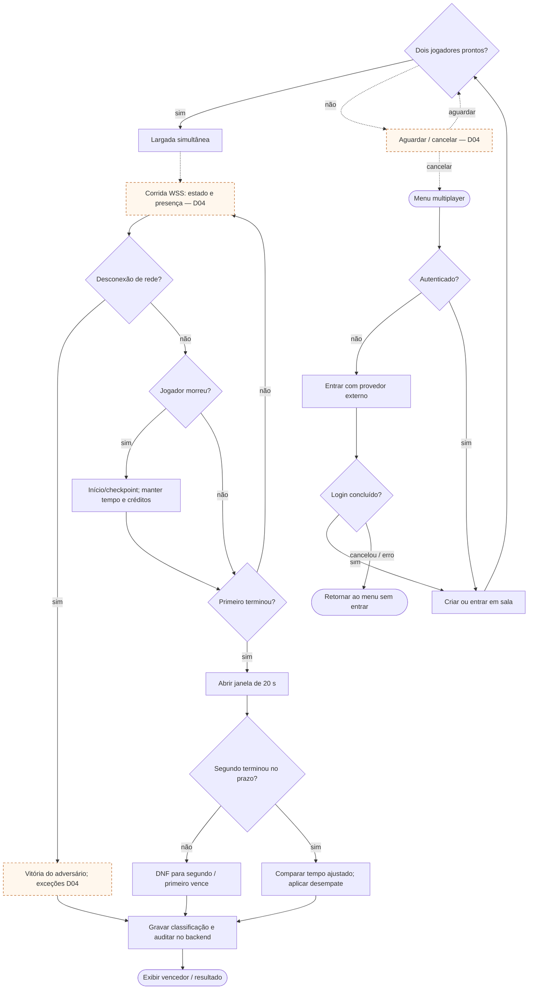
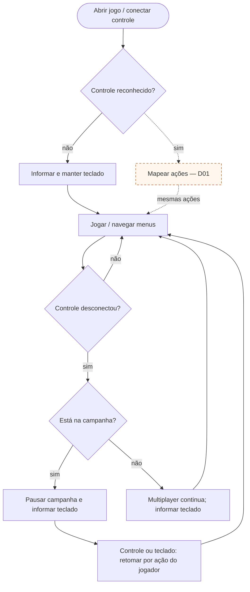
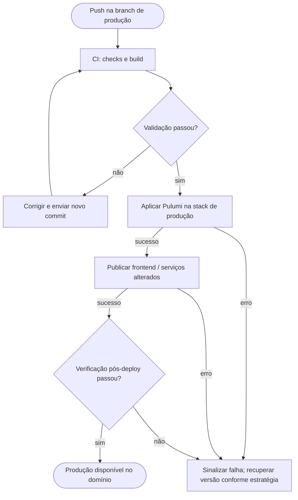
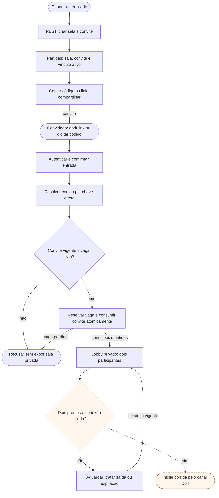
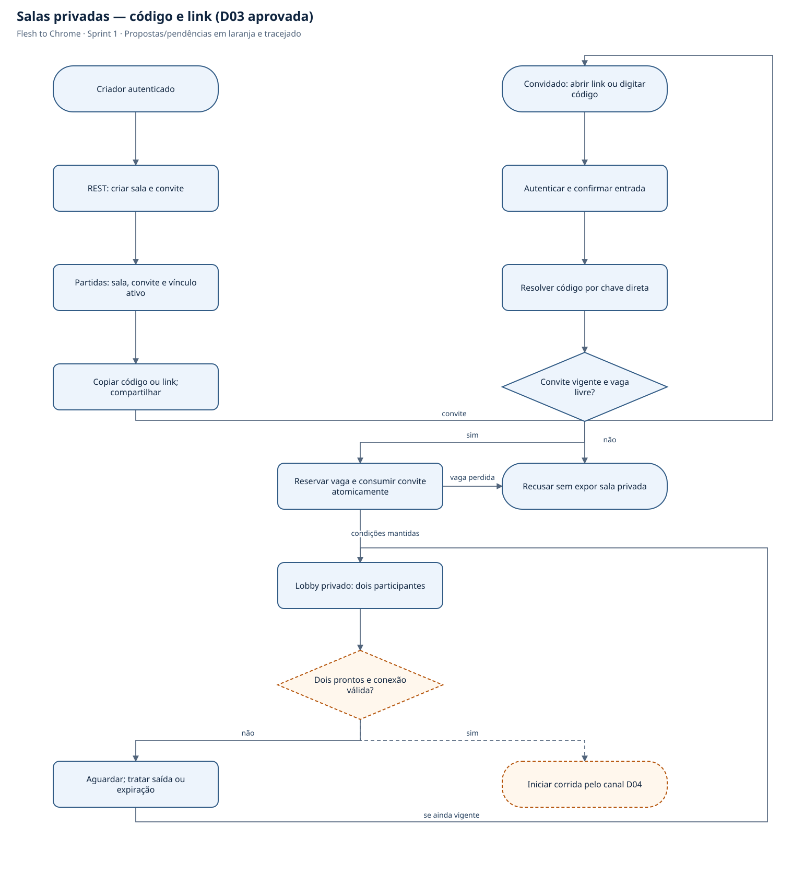
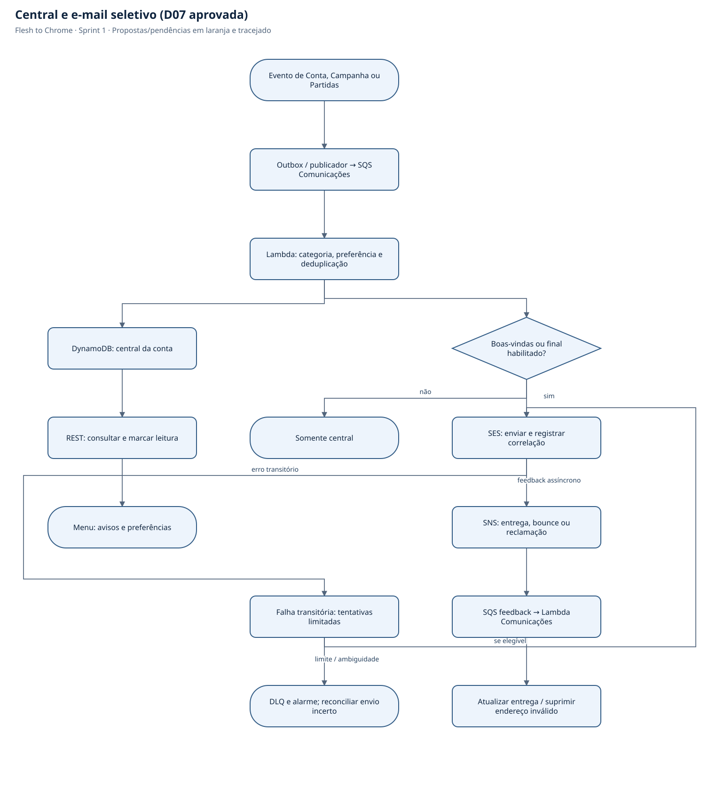

# Fluxogramas

Projeto: **Flesh to Chrome** — especificação da Sprint 1.

Fonte única: [`../diagramas.json`](../diagramas.json). Mermaid e SVG abaixo são gerados por `python3 isn/scripts/gerar_diagramas.py` a partir da raiz do repositório. Não editar as versões geradas separadamente.

Os diagramas descrevem o sistema planejado, não comprovam implementação. Propostas e decisões pendentes têm rótulo Dxx e/ou traço pontilhado; ver [registro de decisões](07-decisoes-pendentes.md).

## 1. Login, save local e comunicações

D06 aprovada: sem login, campanha apenas na sessão; fechar/recarregar descarta progresso. Preservar estado durante autenticação e vincular à conta conforme D05: comparar cópias, confirmar importação e exigir escolha em conflito. Cache persistente isolado por conta; auditar importação aceita, sem histórico anterior ao login. Cancelar mantém visitante somente na sessão aberta. Troca de conta não transfere envios nem cosméticos. Descartar memória pendente apenas ao retomar após saída (D10), não ao autenticar na mesma sessão. Primeiro cadastro dispara comunicação D07 sem bloquear a campanha.




## 2. Loop da fase e persistência

Checkpoint e fim de fase são avaliados mesmo sem obstáculos. Na campanha, créditos não consolidados se perdem na morte; o modo multiplayer usa a regra própria RN08. A descida não contém créditos comuns. Após morte, scan do trecho volta a oculto. D06: salvamento persistente somente após autenticação; para visitante, marcos e snapshot existem apenas na sessão e são descartados ao fechar/recarregar.




## 3. Clínica, implante e próxima fase

O procedimento acontece sem escolha de aceitar/recusar. Aceitação de Alex é narrativa. D06: atualizar estado da sessão; persistir cache e sincronizar na nuvem somente para conta autenticada. Visitante perde campanha ao fechar/recarregar. Falha de rede mantém cache da conta e pendência, sem bloquear gameplay.




## 4. Campanha completa e finais

A descida usa a ordem e o retry do fluxo específico. Snapshot pré-Portão permanece separado; restauração integral permite repetir a escolha. Corpo de Hollow é o estado preservado na quebra, sem novas retiradas. D06: salvamento persistente somente após autenticação; para visitante, marcos e snapshot existem apenas na sessão e são descartados ao fechar/recarregar.


## 5. Descida — memória, retry e retirada

D10 aprovada: memória fica pendente até a retirada do implante da fase. Morte, reinício manual ou saída antes disso apagam a pendente e exigem recoleta; checkpoint não consolida. Retirada consolida memória, corpo e perda de habilidade juntos; memórias anteriores sobrevivem. Morte/saída/reinício não consomem retry por si sós. Retorno segue RN01/RN03; D12 aprovada: todas as memórias após o último checkpoint e antes da área de retirada, permitindo recoleta. D1 Topo/propulsores → D2 Corporativo/olhos → D3 Urbano/braços → D4 Industrial/pernas. George recusa ajuda somente na primeira etapa. D06: salvamento persistente somente após autenticação; para visitante, marcos e snapshot existem apenas na sessão e são descartados ao fechar/recarregar.




## 6. Partida multiplayer e resultado

Dois jogadores autenticados, salas no backend e resultados persistidos. D03 aprovada: entrada por código/link privado e cancelamento da sala se alguém sair antes da largada. D04 cobre autoridade, transporte e detecção de queda. Durante a janela única de 20 s, o segundo continua sujeito a morte, checkpoint e desconexão. Resultado não altera campanha nem define ranking global. WSS recomendado para protótipo; conexão recente antes da largada. Não retomar corrida após derrota. Duração máxima sem chegada, queda simultânea e falha de infraestrutura continuam em D04. Documento 14 detalha o ingresso aprovado.




## 7. Gamepad físico — conexão e perda de dispositivo

D02 aprovada: desconexão pausa automaticamente a campanha e informa teclado disponível; retomada depende de ação do jogador, não apenas da reconexão. Multiplayer continua com aviso e alternativa pelo teclado. D01 ainda define mapeamento/hardware. Desconexão física não declara derrota de rede.




## 8. Publicação automática de produção

Pipeline publica serviços alterados de forma independente; base compartilhada e contratos versionados em Pulumi. Dev em nuvem usa stack própria. A seleção de Lambda e serviços gerenciados reduz compute permanente; implantação depende de quotas/plano/custos confirmados para a conta ainda não criada. Pulumi gerencia zona/registros Route 53 e certificados ACM na base. A verificação pós-deploy inclui resolução DNS e HTTPS; nameservers dependem da delegação inicial no registrador.




## 9. Salas privadas — código e link (D03 aprovada)

Modelo aprovado: convite aleatório de 10 caracteres, expiração de lobby em 10 min e uma partida ativa por conta. Código/link compartilham o mesmo convite; sem busca pública. Reserva da segunda vaga em transação. Saída antes da largada cancela a sala. TTL apenas limpa resíduos; duração/autoridade da corrida continuam em D04. Histórico privado de 30 dias. Documento 14.





## 10. Central e e-mail seletivo (D07 aprovada)

D07 aprovada: central com categorias, leitura e preferências; sem polling contínuo nem avisos por frame. Compra gera confirmação apenas no jogo. SES envia boas-vindas e final habilitado; SNS Standard e SQS de feedback registram entrega/bounce/reclamação. Retenção de exibição não elimina prematuramente deduplicação. Modelo do documento 14 aprovado; implementação ainda não executada.

```mermaid
flowchart TD
  event(["Evento de Conta, Campanha ou Partidas"])
  queue["Outbox / publicador → SQS Comunicações"]
  worker["Lambda: categoria, preferência e deduplicação"]
  inbox["DynamoDB: central da conta"]
  email{"Boas-vindas ou final habilitado?"}
  read["REST: consultar e marcar leitura"]
  skip(["Somente central"])
  ses["SES: enviar e registrar correlação"]
  end(["Menu: avisos e preferências"])
  sns["SNS: entrega, bounce ou reclamação"]
  feedback["SQS feedback → Lambda Comunicações"]
  delivery["Atualizar entrega / suprimir endereço inválido"]
  retry["Falha transitória: tentativas limitadas"]
  dlq(["DLQ e alarme; reconciliar envio incerto"])
  event --> queue
  queue --> worker
  worker --> inbox
  worker --> email
  inbox --> read
  read --> end
  email -->|"não"| skip
  email -->|"sim"| ses
  ses -->|"feedback assíncrono"| sns
  sns --> feedback
  feedback --> delivery
  ses -->|"erro transitório"| retry
  retry -->|"se elegível"| ses
  retry -->|"limite / ambiguidade"| dlq
```


